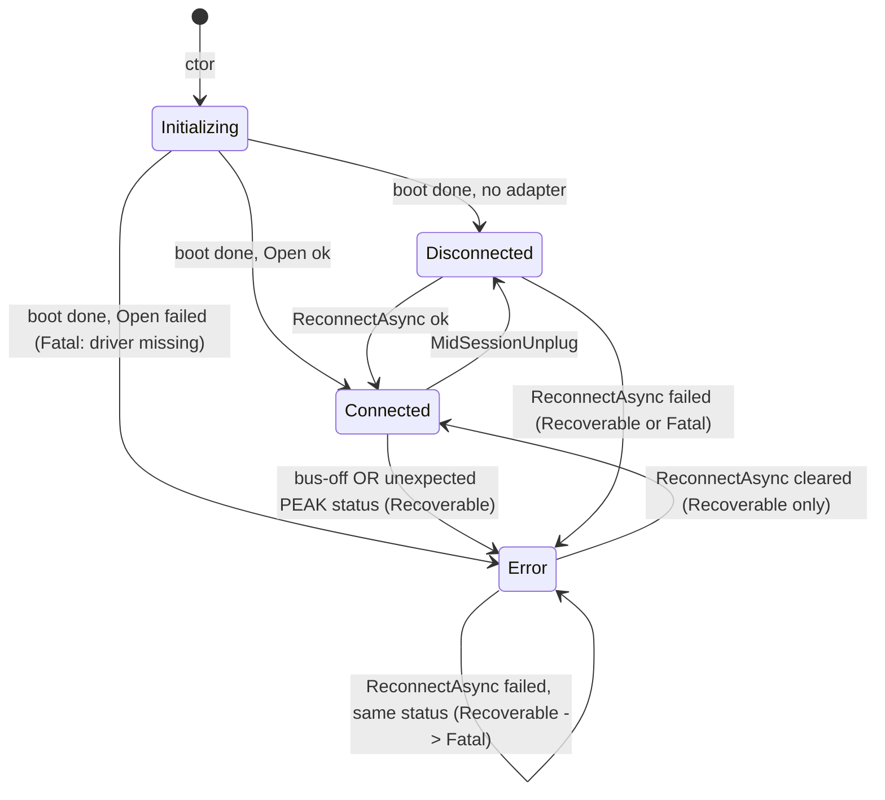

# Data Model: CAN Link and Panel Discovery

**Phase 1 output for**: [plan.md](./plan.md)

F# types, operations over them, invariants, and cross-references to the Lean Phase 2 modules that mechanise the invariants. The Lean files prove the algebraic invariants by construction; the F# types are the surface implementation.

---

## 1. CAN link state

### 1.1 `CanLinkState` (closed DU, `src/ButtonPanelTester.Core/Can/CanLinkState.fs`)

```fsharp
type DisconnectReason =
    | NoAdapterPresent
    | LinkNotYetOpened
    | MidSessionUnplug
    | ReconnectPending

type ErrorClassification =
    | Recoverable of detail: string
    | Fatal of detail: string

type CanLinkState =
    | Initializing
    | Connected of adapter: AdapterIdentification * openedAt: DateTimeOffset
    | Disconnected of reason: DisconnectReason * since: DateTimeOffset
    | Error of classification: ErrorClassification * since: DateTimeOffset
```

| Case | Spec FR/SC reference | Notes |
|---|---|---|
| `Initializing` | edge case "Dictionary fetch has not yet completed" | Set on construction; cleared when dictionary boot completes (FR-001). |
| `Connected` | FR-002, FR-004 (adapter identification) | `AdapterIdentification` rendered locally (Principle V — never leaves). |
| `Disconnected` | FR-002, FR-005 (sub-classification) | `DisconnectReason` distinguishes "no adapter" from "link down". |
| `Error.Recoverable` | FR-002a; edges "bus-off" / "unexpected status (first time)" | Reconnect click can clear (FR-003). |
| `Error.Fatal` | FR-002a; edges "driver not installed" / "unexpected status (repeated)" | Reconnect click is unlikely to help (FR-003). |

**Detail-string convention.** Adapters that need to pair a short headline
with technical detail encode both into the `Recoverable`/`Fatal` `detail`
string using `\n` as the separator. First line = headline shown in the
status row chip (`CanStatusRow.headline` splits on the first `\n`);
subsequent lines = technical detail rendered in the GUI detail
affordance (`CanStatusRow.detailText`). The data model stays unchanged.
Consumers: `PcanCanLink.buildFailureState` (producer comment block);
`CanStatusRow.firstLine` (consumer). A structured
`technicalDetail: string option` refactor would touch Lean theorems and
is deferred to a later spec.

**`since` semantics (FR-002b).** The `since: DateTimeOffset` carried by
`Error(_, since)` reflects the moment the underlying root cause was
**first observed**. Producers (link adapters, `CanLinkService`'s
Recoverable→Fatal escalation) MUST preserve the original `since` when
the same root cause is re-observed across reconnect attempts. Updates
are correct only when the cause itself changes — for example, the chip
transitions out of Error (Connected or Disconnected) and a later
distinct fault re-enters Error. The same rule applies to the
`openedAt` field of `Connected` and the `since` of `Disconnected` for
internal consistency, though the bench-driven case is FR-002b's Error
path.

### 1.2 State-machine diagram



### 1.3 Invariants

- **Invariant #1** — *classification totality.* `CanLinkState` always classifies as exactly one of `{Initializing, Connected, Disconnected, Error.Recoverable, Error.Fatal}`. **Lean**: `Phase2/CanLinkState.lean` — `state_classification_total`.
- **Invariant #2** — *Recoverable → Fatal escalation is one-way per (reconnect attempt, root cause).* Operational, lives in `CanLinkService` per [research.md](./research.md) R8. Not mechanised in Lean (operational state across multiple Open attempts; an algebraic statement would not capture the temporal "across attempts" semantics cleanly).
- **Invariant #3** — *passive observation emits no transmit.* **Lean**: `Phase2/PassiveObserver.lean` — `observe_emits_no_transmit`. Mechanises SC-007 + FR-014.

---

## 2. WHO_I_AM frame

### 2.1 Wire layout (`src/ButtonPanelTester.Core/Can/WhoIAmFrame.fs`)

Authoritative source: panel firmware `stem-fw-pac5524-tastiera-can-app-*/AutoAddressSlave.c:175–181` (broadcast payload construction), confirmed by the audit recorded in [`docs/Context/bpt-rollout/CORRECTIONS.md`](../../docs/Context/bpt-rollout/CORRECTIONS.md) §C1, §C2. The canonical wire-format contract lives in [contracts/who-i-am-wire-format.md](./contracts/who-i-am-wire-format.md); this section reflects the F# representation only.

### 2.2 F# types

```fsharp
type PanelUuid = PanelUuid of uuid0: uint32 * uuid1: uint32 * uuid2: uint32
type FwType = FwType of byte
type MachineTypeByte = MachineTypeByte of byte

type WhoIAmFrame = {
    MachineType : MachineTypeByte
    FwType : FwType
    Uuid : PanelUuid
}

val parse : ReadOnlyMemory<byte> -> WhoIAmFrame option   // None on malformed (FR-013)
val encode : WhoIAmFrame -> byte[]                       // 15-byte buffer
```

### 2.3 Invariant

- **Round-trip**: `parse (encode f) = Some f` for every well-formed `WhoIAmFrame`. **Lean**: `Phase2/WhoIAmFrame.lean` — `parse_encode_roundtrip`.

---

## 3. Variant identity

### 3.1 `VariantIdentity` (closed DU, `src/ButtonPanelTester.Core/Can/PanelObservation.fs`)

```fsharp
type MarketingVariant =
    | EdenXp     // machineType = 0x03
    | OptimusXp  // machineType = 0x0A
    | R3LXp      // machineType = 0x0B
    | EdenBs8    // machineType = 0x0C

type VariantIdentity =
    | Marketing of MarketingVariant
    | Virgin                  // machineType = 0xFF
    | Unknown of raw: byte    // any other value

val decodeVariant : MachineTypeByte -> VariantIdentity   // total
```

### 3.2 Invariant

- **Totality**: `decodeVariant` is defined on every `byte`. **Lean**: `Phase2/PanelObservation.lean` — `variant_decoding_total`.

The four marketing variants and their `machineType` bytes come from CORRECTIONS.md §"Items unchanged" — confirmed against each motherboard's `ID_MACHINE_TYPE` constant.

---

## 4. Panel observation

### 4.1 `PanelObservation` (record, `src/ButtonPanelTester.Core/Can/PanelObservation.fs`)

```fsharp
type PanelObservation = {
    Uuid : PanelUuid
    VariantByte : MachineTypeByte         // raw byte (FR-009 detail affordance)
    VariantIdentity : VariantIdentity     // decoded (FR-009 row label)
    LastSeen : DateTimeOffset             // FR-010 timestamp
}
```

### 4.2 Mapping rule

A `WhoIAmFrame f` arriving at `now` produces a `PanelObservation` with `Uuid = f.Uuid`, `VariantByte = f.MachineType`, `VariantIdentity = decodeVariant f.MachineType`, `LastSeen = now`.

---

## 5. Panels-on-bus list

### 5.1 `PanelsOnBus` (UUID-keyed map, `src/ButtonPanelTester.Core/Can/PanelsOnBus.fs`)

```fsharp
type PanelsOnBus = Map<PanelUuid, PanelObservation>

val empty : PanelsOnBus
val observe : DateTimeOffset -> WhoIAmFrame -> PanelsOnBus -> PanelsOnBus
val clear : PanelsOnBus -> PanelsOnBus   // for FR-015 link-loss
```

### 5.2 Pruning (`src/ButtonPanelTester.Core/Can/Pruning.fs`)

```fsharp
val prune : ttl: TimeSpan -> now: DateTimeOffset -> PanelsOnBus -> PanelsOnBus
```

For spec-002, `ttl = TimeSpan.FromSeconds 15.0` (FR-011, locked by clarify).

### 5.3 Operational semantics

- `observe now f m` inserts-or-updates `m[f.Uuid]` with a fresh `PanelObservation`. Existing rows have their `LastSeen` advanced; the `VariantByte` and `VariantIdentity` are also re-derived from the latest frame (handles the edge "panel power-cycled out of `AAS_STAND_BY` mid-session" cleanly).
- `prune ttl now m` returns `m` with every row whose `now - lastSeen > ttl` removed.
- `clear m` returns `empty`. Used by `CanLinkService` on Connected → Disconnected (FR-015).

### 5.4 Invariants

- **Coalescing**: `(observe now f m).Count ≤ m.Count + 1`, and the equality case holds iff `f.Uuid ∉ m.Keys`. Same-UUID observations never produce duplicate rows. **Lean**: `Phase2/PanelsOnBus.lean` — `observe_coalesces_by_uuid`.
- **Pruning correctness**: post-prune membership iff `now - lastSeen ≤ ttl`. **Lean**: `Phase2/Pruning.lean` — `prune_partitions_by_threshold`.

---

## 6. Adapter identification

### 6.1 `AdapterIdentification` (record, `src/ButtonPanelTester.Core/Can/CanLinkState.fs`)

```fsharp
type AdapterIdentification = {
    ChannelName : string       // e.g. "PCAN-USB Pro FD (1)"
    DeviceId    : string       // PEAK `PCAN_DEVICE_ID` rendered as `0x<HEX>`,
                               // 2-digit minimum width (PEAK device ID is a
                               // user-settable byte, configurable via PCAN-View);
                               // local-only (Principle V)
    BaudrateBps : int          // always 250000 in spec-002
}
```

The record lives in `Core` because it is part of `CanLinkState.Connected`'s payload and the `ICanLink` port surface — Principle III requires port-shape types to live alongside the port. The construction helper that queries the PEAK driver for the live channel name + device ID sits at `src/ButtonPanelTester.Infrastructure/Can/PcanAdapterIdentity.fs` (Infrastructure side of the boundary).

Rendered in the CAN status row's detail affordance (FR-004). Never leaves the supplier's machine — Principle V is satisfied by construction because the field is GUI-only and there is no telemetry path from this struct.

---

## 7. Cross-reference to Lean Phase 2

| Lean module | Mechanises | F# source |
|---|---|---|
| `Phase2/CanLinkState.lean` | §1.3 Invariant #1 | `Core/Can/CanLinkState.fs` |
| `Phase2/WhoIAmFrame.lean` | §2.3 Round-trip | `Core/Can/WhoIAmFrame.fs` |
| `Phase2/PanelObservation.lean` | §3.2 Totality | `Core/Can/PanelObservation.fs` |
| `Phase2/PanelsOnBus.lean` | §5.4 Coalescing | `Core/Can/PanelsOnBus.fs` |
| `Phase2/Pruning.lean` | §5.4 Pruning correctness | `Core/Can/Pruning.fs` |
| `Phase2/PassiveObserver.lean` | §1.3 Invariant #3 (SC-007) | `Services/Can/CanLinkService.fs` |
