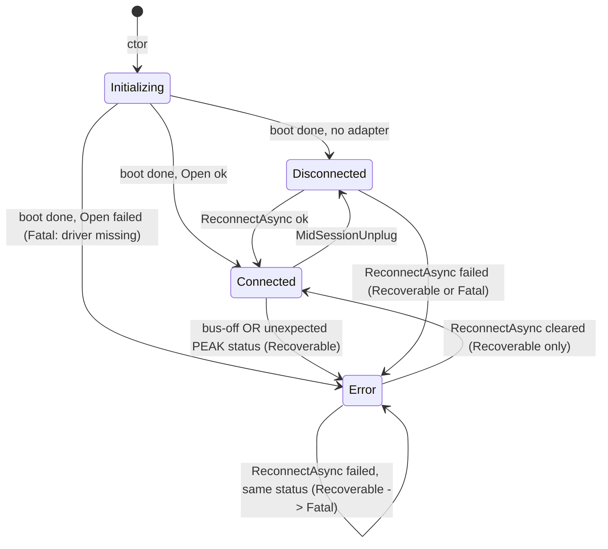

# Data Model: CAN Link Lifecycle

**Phase 1 output for**: [plan.md](./plan.md)

F# types, operations over them, invariants, and cross-references to the Lean Phase 2 modules that mechanise the invariants. The Lean files prove the algebraic invariants by construction; the F# types are the surface implementation.

**Scope note (#151)**: this document covers lifecycle types only. Panel-discovery types (WhoIAmFrame, VariantIdentity, PanelObservation, PanelsOnBus, Pruning) moved to [`specs/003-panel-discovery/data-model.md`](../003-panel-discovery/data-model.md). They cohabit the same `src/ButtonPanelTester.Core/Can/` folder.

---

## 1. CAN link state

### 1.1 `CanLinkState` (closed DU, `src/ButtonPanelTester.Core/Can/CanLinkState.fs`)

```fsharp
type DisconnectReason =
    | NoAdapterPresent
    | LinkNotYetOpened
    | MidSessionUnplug
    | ReconnectPending

type ErrorClassification =
    | Recoverable of detail: string
    | Fatal of detail: string

type CanLinkState =
    | Initializing
    | Connected of adapter: AdapterIdentification * openedAt: DateTimeOffset
    | Disconnected of reason: DisconnectReason * since: DateTimeOffset
    | Error of classification: ErrorClassification * since: DateTimeOffset
```

| Case | Spec FR/SC reference | Notes |
|---|---|---|
| `Initializing` | edge case "Dictionary fetch has not yet completed" | Set on construction; cleared when dictionary boot completes (FR-001). |
| `Connected` | FR-002, FR-004 (adapter identification) | `AdapterIdentification` rendered locally (Principle V — never leaves). |
| `Disconnected` | FR-002, FR-005 (sub-classification) | `DisconnectReason` distinguishes "no adapter" from "link down". |
| `Error.Recoverable` | FR-002a; edges "bus-off" / "unexpected status (first time)" | Reconnect click can clear (FR-003). |
| `Error.Fatal` | FR-002a; edges "driver not installed" / "unexpected status (repeated)" | Reconnect click is unlikely to help (FR-003). |

**Detail-string convention.** Adapters that need to pair a short headline
with technical detail encode both into the `Recoverable`/`Fatal` `detail`
string using `\n` as the separator. First line = headline shown in the
status row chip (`CanStatusRow.headline` splits on the first `\n`);
subsequent lines = technical detail rendered in the GUI detail
affordance (`CanStatusRow.detailText`). The data model stays unchanged.
Consumers: `PcanCanLink.buildFailureState` (producer comment block);
`CanStatusRow.firstLine` (consumer). A structured
`technicalDetail: string option` refactor would touch Lean theorems and
is deferred to a later spec.

**`since` semantics (FR-002b).** The `since: DateTimeOffset` carried by
`Error(_, since)` reflects the moment the underlying root cause was
**first observed**. Producers (link adapters, `CanLinkService`'s
Recoverable→Fatal escalation) MUST preserve the original `since` when
the same root cause is re-observed across reconnect attempts. Updates
are correct only when the cause itself changes — for example, the chip
transitions out of Error (Connected or Disconnected) and a later
distinct fault re-enters Error. The same rule applies to the
`openedAt` field of `Connected` and the `since` of `Disconnected` for
internal consistency, though the bench-driven case is FR-002b's Error
path.

### 1.2 State-machine diagram



### 1.3 Invariants

- **Invariant #1** — *classification totality.* `CanLinkState` always classifies as exactly one of `{Initializing, Connected, Disconnected, Error.Recoverable, Error.Fatal}`. **Lean**: `Phase2/CanLinkState.lean` — `state_classification_total`.
- **Invariant #2** — *Recoverable → Fatal escalation is one-way per (reconnect attempt, root cause).* Operational, lives in `CanLinkService` per [research.md](./research.md) R8. Not mechanised in Lean (operational state across multiple Open attempts; an algebraic statement would not capture the temporal "across attempts" semantics cleanly).
- **Invariant #3** — *passive observation emits no transmit.* **Lean**: `Phase2/PassiveObserver.lean` — `observe_emits_no_transmit`. Mechanises SC-007 + FR-014.

---

## 2. Adapter identification

### 2.1 `AdapterIdentification` (record, `src/ButtonPanelTester.Core/Can/CanLinkState.fs`)

```fsharp
type AdapterIdentification = {
    ChannelName : string       // e.g. "PCAN-USB Pro FD (1)"
    DeviceId    : string       // PEAK `PCAN_DEVICE_ID` rendered as `0x<HEX>`,
                               // 2-digit minimum width (PEAK device ID is a
                               // user-settable byte, configurable via PCAN-View);
                               // local-only (Principle V)
    BaudrateBps : int          // always 250000 in spec-002
}
```

The record lives in `Core` because it is part of `CanLinkState.Connected`'s payload and the `ICanLink` port surface — Principle III requires port-shape types to live alongside the port. The construction helper that queries the PEAK driver for the live channel name + device ID sits at `src/ButtonPanelTester.Infrastructure/Can/PcanAdapterIdentity.fs` (Infrastructure side of the boundary).

Rendered in the CAN status row's detail affordance (FR-004). Never leaves the supplier's machine — Principle V is satisfied by construction because the field is GUI-only and there is no telemetry path from this struct.

---

## 3. Cross-reference to Lean Phase 2

| Lean module | Mechanises | F# source |
|---|---|---|
| `Phase2/CanLinkState.lean` | §1.3 Invariant #1 | `Core/Can/CanLinkState.fs` |
| `Phase2/PassiveObserver.lean` | §1.3 Invariant #3 (SC-007) | `Services/Can/CanLinkService.fs` |

Panel-discovery cross-references (`WhoIAmFrame.lean`, `PanelObservation.lean`, `PanelsOnBus.lean`, `Pruning.lean`) live in [`specs/003-panel-discovery/data-model.md`](../003-panel-discovery/data-model.md) §7.
