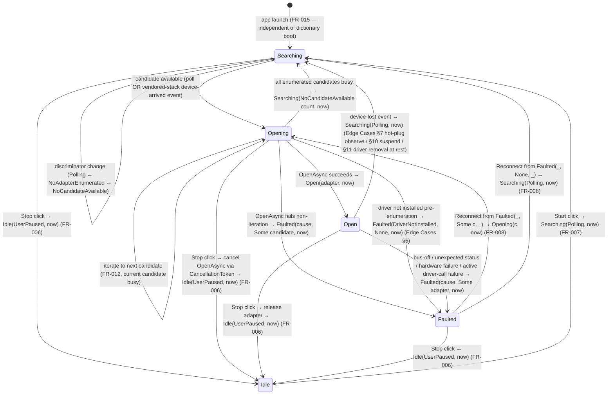

# Data Model: CAN Link Lifecycle

**Phase 1 output for**: [plan.md](./plan.md)

F# types, invariants, and cross-references to the Lean Phase 2 modules that mechanise the invariants. The Lean files prove the algebraic invariants by construction; the F# types are the surface implementation.

**Status**: Phase B rewrite (2026-05-27, supersedes substrate). Aligned with [`spec.md`](./spec.md) `f04318e` — five-family FSM, severity classifier removed, candidate carried in `Faulted`.

**Scope note (#151)**: this document covers lifecycle types only. Panel-discovery types (WhoIAmFrame, VariantIdentity, PanelObservation, PanelsOnBus, Pruning) live in [`specs/003-panel-discovery/data-model.md`](../003-panel-discovery/data-model.md). They cohabit the same `src/ButtonPanelTester.Core/Can/` folder.

---

## 1. CAN link state

### 1.1 `CanLinkState` (closed DU, `src/ButtonPanelTester.Core/Can/CanLinkState.fs`)

```fsharp
/// The operator's reason for holding the link in Idle.
/// Spec-002 defines exactly one cause; the type is closed.
/// `AwaitingBoot` was dropped during the 2026-05-27 redesign because dictionary
/// and CAN have no shared infrastructure dependency (FR-015).
type IdleCause =
    | UserPaused

/// The progress of a Searching round.
/// `Polling` is the in-flight scan / event-wait; `NoAdapterEnumerated` and
/// `NoCandidateAvailable` are observation outcomes within a round before the
/// next poll or vendored-stack device-arrived event re-enters `Polling`.
type SearchAttempt =
    | NoAdapterEnumerated                          // host returns zero PEAK adapters (Edge Cases §1)
    | NoCandidateAvailable of count: int           // ≥1 enumerated; all returned busy (FR-012, Edge Cases §2)
    | Polling                                      // scan / event-wait in flight

/// The root cause of a Faulted state. Each constructor names one identifiable
/// failure mode. No severity classifier — the cause itself carries the
/// diagnostic; the operator reads it and decides whether to Reconnect.
type FaultCause =
    | BusOff                                       // CAN controller signalled bus-off (Edge Cases §3)
    | UnexpectedAdapterStatus of code: uint32      // PEAK returned an unrecognised status (Edge Cases §4)
    | DriverNotInstalled                           // PCANBasic native DLL missing (Edge Cases §5, §11)
    | AdapterHardwareFailure                       // driver responded then adapter went unresponsive (Edge Cases §8)

/// Top-level CAN link family. Pattern-match exhaustiveness on these five cases
/// drives the chip-colour projection (FR-002) and the affordance-button
/// visibility map (FR-006 / FR-007 / FR-008). Sub-discriminators live in the
/// per-case payloads — they affect the headline string and detail affordance
/// but not the chip family. The `since: DateTimeOffset` carried by every case
/// is the FR-004 sticky-since timestamp; `Open` calls its variant `openedAt`
/// because that case is grounded in a successful OpenAsync.
type CanLinkState =
    | Idle      of cause: IdleCause                                       * since: DateTimeOffset
    | Searching of attempt: SearchAttempt                                 * since: DateTimeOffset
    | Opening   of candidate: AdapterCandidate                            * since: DateTimeOffset
    | Open      of adapter: AdapterIdentification                         * openedAt: DateTimeOffset
    | Faulted   of cause: FaultCause * candidate: AdapterCandidate option * since: DateTimeOffset
```

| Case | Spec reference | Notes |
|---|---|---|
| `Idle(UserPaused, _)` | FR-006 (Stop), FR-007 (Start), Edge Cases §6 | Chip grey. Operator-paused only. Only `Start` is enabled; the adapter (if any was held) has been released. |
| `Searching(Polling, _)` | FR-002, FR-012, FR-015 | Chip grey. Initial state on app launch. Re-entered after every observation that doesn't promote to `Opening`. |
| `Searching(NoAdapterEnumerated, _)` | Edge Cases §1, SC-002 | Chip grey. Headline: `Searching · no PEAK adapter found — plug in the adapter`. |
| `Searching(NoCandidateAvailable count, _)` | FR-012, Edge Cases §2, SC-009 | Chip grey. The `count` is the number of enumerated PEAK adapters that returned busy; `count = 1` is the production bench reality, `count ≥ 2` is the multi-adapter resilience case. |
| `Opening(candidate, _)` | FR-005, FR-008, FR-012 | Chip grey. `candidate` carries the channel handle + display name; rendered in the headline (`Opening · contacting <DisplayName>`). Realises FR-008's `Faulted(_, Some c, _)` Reconnect path. |
| `Open(adapter, openedAt)` | FR-002, FR-004, FR-005, FR-010 | Chip green. `adapter` is the post-Open self-description. Exclusive driver-level access is held (FR-010). |
| `Faulted(cause, Some candidate, _)` | FR-008, Edge Cases §3 / §4 / §8 / §10 / §11 | Chip red. Reconnect retries the same candidate → `Opening(candidate, now)`. |
| `Faulted(cause, None, _)` | FR-008, Edge Cases §5 | Chip red. No candidate to retry (driver missing before any enumeration). Reconnect collapses to `Searching(Polling, now)`; FR-008 SHOULD reflect this in the button caption. |

**Sticky-since semantics (FR-004).** Every `since: DateTimeOffset` field reflects when the underlying root cause — state family + discriminator — was first observed. Passive re-observation of the same family + discriminator MUST preserve the original `since`. Updates fire when:

1. The family changes (e.g., `Searching → Opening`).
2. The discriminator within a family changes (e.g., `Searching(NoAdapterEnumerated) → Searching(Polling)`).
3. A user-initiated transition returns the FSM to the same family via an intervening state (e.g., `Faulted(BusOff) → Opening → Faulted(BusOff)` updates `since` on the second arrival).

The same rule applies to `Open`'s `openedAt`, which is the moment OpenAsync succeeded against this `adapter`.

### 1.2 State-machine diagram



Notes on edges not visually distinct in the diagram:

- The `Opening → Opening` self-edge realises FR-012's multi-adapter iteration: the current candidate returned busy and the next enumerated candidate is tried before the FSM falls through to `Searching(NoCandidateAvailable)`.
- The `Open → Searching` edge covers the host suspend/resume cycle (Edge Cases §10) and driver-uninstall-at-rest (Edge Cases §11) as device-lost-style observations. Active-call driver failure goes to `Faulted` instead (the same physical event, different observation path).
- The Stop-during-Opening edge is the only edge that requires `CancellationToken` propagation (FR-006); all other operator-initiated edges land synchronously, and all observation-driven edges land off driver replies or vendored-stack events.
- Edge Cases §9 (external exclusive-mode tool requests access while BPT holds Open) and §12 (device-arrived event for a different adapter while in Open) do not appear because they do not trigger an FSM transition by design (FR-010, FR-012 iteration scope).

### 1.3 Invariants

- **Invariant #1** — *Family classification totality.* `CanLinkState` always inhabits exactly one of `{ Idle, Searching, Opening, Open, Faulted }`. **Lean**: `Phase2/CanLinkState.lean` — `state_classification_total`.
- **Invariant #2** — *FaultCause exhaustiveness.* Every `Faulted` payload's `cause` is exactly one of `{ BusOff, UnexpectedAdapterStatus, DriverNotInstalled, AdapterHardwareFailure }`. New fault modes (if discovered) require an explicit DU extension plus a Lean re-prove. **Lean**: `Phase2/CanLinkState.lean` — `fault_cause_total`.
- **Invariant #3** — *IdleCause exhaustiveness.* Every `Idle` payload's `cause` is `UserPaused`. The proof is degenerate (one case); kept to preserve the per-sub-DU totality discipline and to fail loudly if a future amendment adds an `Idle` cause without updating the renderer. **Lean**: `Phase2/CanLinkState.lean` — `idle_cause_total`.
- **Invariant #4** — *Faulted Reconnect target totality.* For every `Faulted(_, candidate, _)`, the Reconnect transition target is uniquely determined by `candidate`: `Some c → Opening(c, now)`, `None → Searching(Polling, now)`. **Lean**: `Phase2/CanLinkState.lean` — `faulted_reconnect_target_total`. Auxiliary lemma; bench reads as the FR-008 contract mechanised.
- **Invariant #5** — *Sticky-since (FR-004).* Operational. Producers (link adapters, `CanLinkService`) MUST preserve `since` across passive re-observation of the same family + discriminator. Not mechanised in Lean — the rule is temporal across emissions, not algebraic over a single value. Enforced by an FsCheck property in `tests/ButtonPanelTester.Tests/Property/Can/` named and listed in [plan.md](./plan.md) §Constitution Check (Principle II).
- **Invariant #6** — *Exclusivity-on-Open (FR-010).* Operational. The `PcanCanLink` adapter MUST request exclusive driver-level access on the OpenAsync call that lands the FSM in `Open`. Not mechanised in Lean — exclusivity is a driver-level fence, not an algebraic property of the state. Verified at the boundary by SC-011 (bench-only; see plan.md for the CI surrogate).
- **Invariant #7** — *Passive observer emits no transmit (FR-013, SC-007).* The FSM's projection onto the CAN transmit alphabet is the empty trace; no FSM transition emits a CAN frame. Carried forward from the substrate unchanged because passive observation is family-agnostic. **Lean**: `Phase2/PassiveObserver.lean` — `observe_emits_no_transmit`.

### 1.4 Rendering contract

The CAN status row renders the **current** `CanLinkState` value on every emission of `LinkStateChanged` (FR-014). There is no snapshot freeze during `Opening` (or any other family): if the FSM emits an updated state mid-render — discriminator change, candidate iteration, click-acknowledge transition — the detail affordance follows the new value as soon as the consumer observes it. Resolves checklist item **CHK019**. The truth-to-state principle (FR-009) governs the chip and the detail affordance equally; the click-acknowledge cue is button-level and is independent of the state render (FR-009 Note).

---

## 2. Adapter candidate

### 2.1 `AdapterCandidate` (record, `src/ButtonPanelTester.Core/Can/CanLinkState.fs`)

```fsharp
/// An enumerated PEAK adapter the FSM has selected to attempt Open against.
/// Distinct from `AdapterIdentification`: a candidate exists once enumeration
/// returns it, before any successful Open. Carried in `Opening` (always
/// present) and in `Faulted` (optionally — `None` when the fault occurred
/// before any candidate was enumerated, e.g. driver not installed).
type AdapterCandidate = {
    /// PEAK PCAN channel handle (`TPCANHandle`, an opaque token used by
    /// Peak.PCANBasic.NET). Drives OpenAsync; not rendered to the operator
    /// directly.
    ChannelHandle : uint16
    /// Human-friendly label for headline / detail rendering when the candidate
    /// is known — e.g. "PCAN-USB Bus 1" or the channel name reported by the
    /// vendored stack's enumeration. Rendered as `Opening · contacting
    /// <DisplayName>` and in the `Faulted` detail affordance when `Some`.
    DisplayName : string
}
```

The record lives in `Core` because it appears in `CanLinkState.Opening` and `CanLinkState.Faulted` payloads, and Principle III requires port-shape types to live alongside the port. The enumeration helper that produces candidates from the PEAK driver sits on the Infrastructure side of the boundary (`src/ButtonPanelTester.Infrastructure/Can/`); the concrete filename is pinned by [plan.md](./plan.md) §Project Structure.

Like `AdapterIdentification`, `AdapterCandidate` is local-only — never leaves the supplier's machine (Principle V). It carries no identity-bearing OS field; the channel handle is a transient PEAK driver token, and `DisplayName` is a render-only string sourced from the driver.

---

## 3. Adapter identification

### 3.1 `AdapterIdentification` (record, `src/ButtonPanelTester.Core/Can/CanLinkState.fs`)

```fsharp
/// The self-description of an opened PEAK adapter, available from `Open`
/// onwards. Produced by the PEAK driver in response to the OpenAsync call;
/// rendered in the row's detail affordance (FR-005).
type AdapterIdentification = {
    /// Channel name reported by the PEAK driver — e.g. "PCAN-USB Pro FD (1)".
    ChannelName : string
    /// PEAK `PCAN_DEVICE_ID` rendered as `0x<HEX>` with 2-digit minimum width.
    /// The PEAK device ID is a user-settable byte (configurable via PCAN-View);
    /// rendered locally only (Principle V — never leaves the supplier's
    /// machine).
    DeviceId : string
    /// Bus baud rate. Always 250000 in spec-002 (firmware-fixed; see
    /// spec.md §Assumptions).
    BaudrateBps : int
}
```

The record lives in `Core` for the same Principle III reason as `AdapterCandidate`. The construction helper that queries the PEAK driver for the live channel name and device ID sits at the Infrastructure side of the boundary; the concrete filename is pinned by [plan.md](./plan.md) §Project Structure.

Rendered in the CAN status row's detail affordance (FR-005). Never leaves the supplier's machine — Principle V is satisfied by construction because the field is GUI-only and there is no telemetry path from this record.

---

## 4. Cross-reference to Lean Phase 2

| Lean theorem | File | Mechanises | F# source |
|---|---|---|---|
| `state_classification_total` | `Phase2/CanLinkState.lean` | §1.3 Invariant #1 (5-family totality) | `Core/Can/CanLinkState.fs` |
| `fault_cause_total` | `Phase2/CanLinkState.lean` | §1.3 Invariant #2 (FaultCause totality) | `Core/Can/CanLinkState.fs` |
| `idle_cause_total` | `Phase2/CanLinkState.lean` | §1.3 Invariant #3 (IdleCause degenerate totality) | `Core/Can/CanLinkState.fs` |
| `faulted_reconnect_target_total` | `Phase2/CanLinkState.lean` | §1.3 Invariant #4 (FR-008 Reconnect bifurcation) | `Services/Can/CanLinkService.fs` (Reconnect handler) |
| `observe_emits_no_transmit` | `Phase2/PassiveObserver.lean` | §1.3 Invariant #7 (SC-007 + FR-013) | `Services/Can/CanLinkService.fs` |

**Re-prove cost vs the substrate.** The substrate's Phase 2 carried two theorems — `state_classification_total` over four families and `observe_emits_no_transmit`. The five-family redesign retires the old `state_classification_total` shape and adds four lemmas: the new five-family `state_classification_total`, `fault_cause_total`, `idle_cause_total`, and the `faulted_reconnect_target_total` auxiliary. `observe_emits_no_transmit` carries forward unchanged because passive observation is family-agnostic. The substrate's `transition_reachability_closed` theorem is dropped — the new FSM's transition graph is dense enough that a per-pair reachability theorem is no longer load-bearing; reachability is covered by an FsCheck property listed in [plan.md](./plan.md) §Constitution Check (Principle II).

Panel-discovery cross-references (`WhoIAmFrame.lean`, `PanelObservation.lean`, `PanelsOnBus.lean`, `Pruning.lean`) live in [`specs/003-panel-discovery/data-model.md`](../003-panel-discovery/data-model.md) §7.
