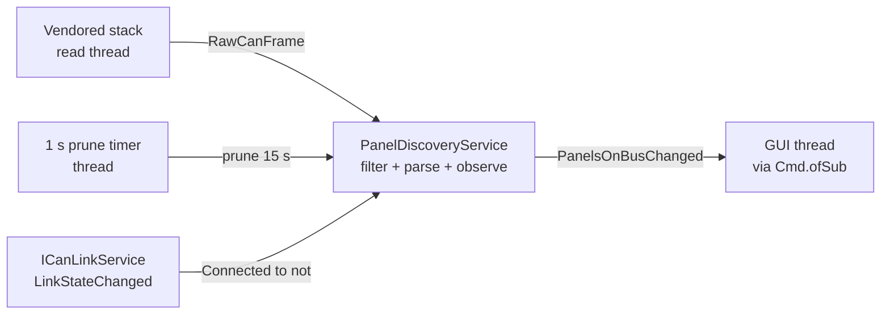

# Contract: `ICanFrameStream` port

**Phase 1 output for**: [../plan.md](../plan.md)

**Implements**: FR-001 (receive side — observation upstream of the panel list), FR-009 (receive-only; the port has no send surface)

This is the receive boundary spec-003 observes through. It is a Constitution
Principle III port: an F# interface in `<App>.Core` with a production adapter in
`<App>.Infrastructure` and a virtual adapter in tests. Both the port and its
struct payload **already ship** in the tree (`src/ButtonPanelTester.Core/Can/Ports.fs`,
landed early under #121); this contract documents the shape spec-003 builds on
and the one adapter still to write.

## Port definition (F#) — shipped

`src/ButtonPanelTester.Core/Can/Ports.fs`:

```fsharp
[<Struct>]
type RawCanFrame =
    { CanId: uint32                     // arbitration ID (29-bit extended-frame format)
      Payload: ReadOnlyMemory<byte>     // reassembled logical payload; valid only during OnNext
      ReceivedAt: DateTimeOffset }      // adapter-provided timestamp

type ICanFrameStream =
    /// Hot observable of every raw CAN frame received while the link is up.
    /// Frames received while the link is down are dropped silently
    /// (no buffering across reconnects).
    abstract member RawFramesReceived: IObservable<RawCanFrame>
```

The `[<Struct>]` value type keeps the receive thread allocation-free (see
[../research.md](../research.md) R7); `ReadOnlyMemory<byte>` lets the vendored
stack hand the tester a pooled buffer without a copy at the port boundary.

> **Citation re-point (tracked in the plan).** The `RawCanFrame` doc-comment in
> the shipped `Ports.fs` still cites
> `specs/002-can-link-and-panel-discovery/contracts/can-frame-stream-port.md`.
> That path is the pre-split combined spec; spec-003 now owns this contract, so
> the plan schedules re-pointing the comment to **this** file as part of the
> discovery-pipeline slice (see [../plan.md](../plan.md) §Citation re-pointing).

## Adapter contract

### Production: `PcanCanFrameStream` — to be written (spec-003)

`src/ButtonPanelTester.Infrastructure/Can/PcanCanFrameStream.fs`
(`net10.0-windows`). Does **not** exist yet — today the composition root binds a
private `NoOpCanFrameStream` placeholder that emits nothing
(`src/ButtonPanelTester.GUI/Composition/CompositionRoot.fs`). The spec-003
discovery-pipeline slice writes the real adapter and swaps the binding:

- Subscribes to the vendored stack's `PacketReceived` event on the CAN port.
- Translates the event args → `RawCanFrame`: `CanId` from the arbitration ID,
  `Payload` from the reassembled data as `ReadOnlyMemory<byte>`, `ReceivedAt`
  from the adapter timestamp (falling back to `IClock.UtcNow()` if the adapter
  supplies none).
- Allocates nothing per frame on the receive path beyond the struct itself.

### Virtual: `InMemoryCanFrameStream` — shipped

`tests/ButtonPanelTester.Tests/Fakes/Can/InMemoryCanFrameStream.fs` (landed
under #121).

- Constructed from a scripted frame sequence (each frame paired with a delay
  relative to the previous one).
- Walks the script on `Start()`, emitting each `RawCanFrame` after its delay.
- Drives every `Property/Can/` and `Integration/Can/` discovery test, so service
  logic runs on CI with no PEAK hardware (Principle III + IV).

## Frame filter (service layer, not the port)

The port is a **generic** receive surface — later specs reuse it for
transmit-side responses — so it does no filtering. `PanelDiscoveryService` acts
only on frames matching **both**:

- `CanId = 0x1FFFFFFF` (extended-frame broadcast — `SRID_BROADCAST`), **and**
- `Payload.Length = 15` (the WHO_I_AM wire size — see
  [who-i-am-wire-format.md](./who-i-am-wire-format.md)).

Every other frame is ignored at the service layer. A frame that matches the
`CanId` but fails the length/parse check is a silent drop (FR-007) — it never
flips the CAN status row to Error.

## Threading



- `RawFramesReceived` fires on the vendored stack's read thread.
  `PanelDiscoveryService` owns the merge of three inputs — frames, prune-timer
  ticks, and link-state transitions — and marshals the resulting
  `PanelsOnBus` to the GUI via FuncUI's `Cmd.ofSub`.
- The `ReadOnlyMemory<byte>` payload is valid **only** for the duration of the
  `OnNext` callback. The service parses inside the callback (the parsed
  `WhoIAmFrame` is a value type holding `uint32`/`uint16`/`byte`, no buffer
  reference), so nothing retains the span. Any future subscriber that needs the
  raw bytes past the callback MUST copy (`payload.Span.ToArray()`).

## Test coverage targets

| Test | Layer | File |
|---|---|---|
| `WhoIAmFrameRoundtrip` (FsCheck) | Property | `Property/Can/WhoIAmFrameProperties.fs` |
| `WhoIAmFrameRejectsWrongLength` (FsCheck) | Property | `Property/Can/WhoIAmFrameProperties.fs` |
| `PanelsOnBusCoalescing` (FsCheck) | Property | `Property/Can/PanelsOnBusProperties.fs` |
| `DiscoveryE2EThroughService` | Integration | `Integration/Can/DiscoveryE2ETests.fs` |
| `PruningE2E` | Integration | `Integration/Can/PruningE2ETests.fs` |
| `LinkLossClearsList` | Integration | `Integration/Can/LinkLossClearsListTests.fs` |
| Bench `ObserveLiveVirginPanel` | Hardware E2E | `Integration/Can/Hardware/DiscoveryHardwareTests.fs` (`Category=Hardware`) |
