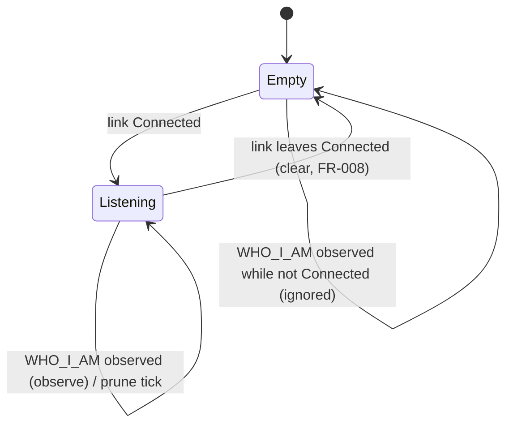

# Data Model: Panel Discovery via Passive WHO_I_AM Observation

**Phase 1 output for**: [plan.md](./plan.md)

F# types, the operations over them, their invariants, and the Lean Phase 2
theorems that mechanise those invariants. This model is baselined on the **types
already in the tree** (`src/ButtonPanelTester.Core/Can/*`, landed early under
#121) and on the firmware-verified wire format in
[contracts/who-i-am-wire-format.md](./contracts/who-i-am-wire-format.md). Each
section is tagged **shipped** (in the tree, correct), **corrected** (in the
tree, but spec-003 fixes it), or **new** (spec-003 builds it).

The lifecycle types this feature observes — `CanLinkState`, the `ICanLinkService`
contract — are owned by the CAN-link lifecycle and are **not** redefined here;
spec-003 depends on them only as the behavioural capability described in
[plan.md](./plan.md) §Relationship to spec-002.

---

## 1. WHO_I_AM frame — *corrected*

### 1.1 F# types (`src/ButtonPanelTester.Core/Can/WhoIAmFrame.fs`)

```fsharp
type PanelUuid = PanelUuid of uuid0: uint32 * uuid1: uint32 * uuid2: uint32
type FwType = FwType of uint16          // CHANGED from `FwType of byte`
type MachineTypeByte = MachineTypeByte of byte

type WhoIAmFrame =
    { MachineType : MachineTypeByte
      FwType      : FwType
      Uuid        : PanelUuid }

val parse  : ReadOnlyMemory<byte> -> WhoIAmFrame option   // None iff length <> 15 (FR-007)
val encode : WhoIAmFrame -> byte[]                        // 15-byte buffer, no padding
```

`parse` operates on the **reassembled** 15-byte application payload (the
`packet[9 .. len-2]` slice of the SP_APP packet — see the wire contract and §5),
not on a raw CAN frame.

### 1.2 What changes from the shipped codec

The shipped `WhoIAmFrame.fs` encodes the wrong wire layout (it models `fwType`
as one byte at offset 1, gates on `fwType = 0x04`, reads UUIDs at 2/6/10, and
writes a padding byte at 14). The corrected codec, per the wire contract:

| Aspect | Shipped (#121) | Corrected (spec-003) |
|---|---|---|
| `FwType` carrier | `byte` | `uint16` |
| `fwType` offset/width | `[1]`, 1 byte | `[1..2]`, big-endian `UInt16` |
| `fwType` acceptance | reject if `<> 0x04` | **no gate** — informational only |
| `uuid0/1/2` offsets | `2 / 6 / 10` | `3 / 7 / 11` |
| trailing byte | padding `[14]` | UUID2's low byte (no padding) |
| `parse` rejection rule | length ≠ 15 **or** `fwType ≠ 0x04` | **length ≠ 15 only** |

`fwType` is the panel **hardware** variant (`0x0004` = 12 V, `0x000F` = 24 V),
retained as informational metadata. It is parsed and round-tripped but is **not**
surfaced in the Panels-on-bus row (the spec asks only for UUID, decoded variant
identity, and last-seen).

### 1.3 Invariant

- **Round-trip**: `parse (encode f) = Some f` for **every** `WhoIAmFrame` (no
  well-formedness precondition, since the only rejection axis — length — cannot
  be violated by `encode`, which always writes 15 bytes).
  **Lean**: `Phase2/WhoIAmFrame.lean` — `parse_encode_roundtrip` (re-stated for
  the corrected codec). Status: **done in Phase A**.

---

## 2. Variant identity — *shipped*

### 2.1 Types (`src/ButtonPanelTester.Core/Can/PanelObservation.fs`)

```fsharp
type MarketingVariant =
    | EdenXp     // machineType = 0x03
    | OptimusXp  // machineType = 0x0A
    | R3LXp      // machineType = 0x0B
    | EdenBs8    // machineType = 0x0C

type VariantIdentity =
    | Marketing of MarketingVariant
    | Virgin                  // machineType = 0xFF
    | Unknown of raw: byte    // any other value, incl. 0x08 TopLift-A

module VariantDecoder =
    val decode : MachineTypeByte -> VariantIdentity   // total
```

The decoder is unchanged and correct; the four marketing bytes and the `0xFF`
virgin marker are firmware constants confirmed in the
[firmware verification](./context/firmware-verification-2026-06-05.md). `0x08`
(TopLift-A) is out of the four-machine scope and decodes to `Unknown 0x08uy`.

### 2.2 Invariant

- **Totality**: `decode` is defined on every `byte`. **Lean**:
  `Phase2/PanelObservation.lean` — `variant_decoding_total`.

---

## 3. Panel observation — *shipped*

### 3.1 Record (`src/ButtonPanelTester.Core/Can/PanelObservation.fs`)

```fsharp
type PanelObservation =
    { Uuid            : PanelUuid
      VariantByte     : MachineTypeByte     // raw byte (FR-003 detail affordance)
      VariantIdentity : VariantIdentity     // decoded (FR-003 row label)
      LastSeen        : DateTimeOffset }     // FR-004 timestamp
```

### 3.2 Mapping rule

A `WhoIAmFrame f` received at instant `now` produces a `PanelObservation` with
`Uuid = f.Uuid`, `VariantByte = f.MachineType`,
`VariantIdentity = VariantDecoder.decode f.MachineType`, `LastSeen = now`.
`f.FwType` is intentionally not carried into the observation (not surfaced this
slice).

---

## 4. Panels-on-bus list — *shipped*

### 4.1 Map + operations (`src/ButtonPanelTester.Core/Can/PanelsOnBus.fs`, `Pruning.fs`)

```fsharp
type PanelsOnBus = Map<PanelUuid, PanelObservation>

module PanelsOnBus =
    val empty   : PanelsOnBus
    val observe : DateTimeOffset -> WhoIAmFrame -> PanelsOnBus -> PanelsOnBus
    val clear   : PanelsOnBus -> PanelsOnBus           // FR-008 link-loss

module Pruning =
    val prune   : ttl: TimeSpan -> now: DateTimeOffset -> PanelsOnBus -> PanelsOnBus
```

For spec-003, `ttl = TimeSpan.FromSeconds 15.0` (FR-005).

### 4.2 Operational semantics

- `observe now f m` inserts-or-updates `m[f.Uuid]` with a fresh
  `PanelObservation`. Existing rows have `LastSeen` advanced to `now`;
  `VariantByte`/`VariantIdentity` are re-derived from the latest frame (so a
  panel power-cycled out of `AAS_STAND_BY` mid-session is reflected accurately).
- `prune ttl now m` removes every row with `now - lastSeen > ttl`.
- `clear m` returns `empty`. Called by `PanelDiscoveryService` on a
  `Connected → ¬Connected` transition (FR-008).

### 4.3 Invariants

- **Coalescing**: `(observe now f m).Count ≤ m.Count + 1`, with equality iff
  `f.Uuid ∉ m.Keys` — same-UUID observations never duplicate a row (FR-002).
  **Lean**: `Phase2/PanelsOnBus.lean` — `observe_coalesces_by_uuid`,
  `observe_preserves_other_keys`.
- **Pruning partition**: post-prune membership iff `now - lastSeen ≤ ttl`
  (FR-005). **Lean**: `Phase2/Pruning.lean` — `prune_partitions_by_threshold`,
  `prune_idempotent`.

These four are the B1/B2/B3 pipeline's correctness core; the re-scope leaves them
unchanged and re-wires only the **input** (§5, §6).

---

## 5. Receive path: read-loop activation + WHO_I_AM reassembly — *new / corrected*

Discovery does **not** consume raw CAN frames directly. Two pieces sit between the
port and the service, per
[contracts/who-i-am-wire-format.md](./contracts/who-i-am-wire-format.md). Both are
new in this re-scope (the original single-frame model had neither — it is why the
pipeline produced nothing on the bench).

### 5.1 Read-loop activation (`Infrastructure.Protocol`, C# — *corrected*)

`CanPort`/`PCANManager` open the channel and report `Connected` but **never start
the receive loop** on a clean open (`StartReading` is reached only on a reconnect),
so `PacketReceived` never fires and nothing is received. spec-003 fixes this
port-correctness gap:

- `IPcanDriver` exposes `StartReading` (`void`).
- `CanPort.ConnectAsync` calls `driver.StartReading()` once the driver reports
  connected — **idempotent** (the monitor's reconnect branches already call it; a
  guard prevents a second `_readTask`).

Reading is spec-003's concern: the #151 split put **observation** here, while
lifecycle/spec-002 polls `GetStatus` and legitimately never reads. No Core/Service
type changes — a C# transport fix, proven by the bench receive E2E (§ tasks).

### 5.2 WHO_I_AM reassembly adapter (`Infrastructure/Can`, F# — *new*)

A new adapter consumes the raw `ICanFrameStream.RawFramesReceived` feed
(`PcanCanFrameStream`, shipped C1/C2 — **kept** as the raw source) and produces a
higher-level **reassembled WHO_I_AM** feed:

```fsharp
// new Core/Can port (Constitution III — pairs with ICanFrameStream + WhoIAmFrame)
type IWhoIAmObserver =
    abstract member WhoIAmObserved : IObservable<WhoIAmFrame>

// new adapter (Infrastructure/Can), consuming ICanFrameStream:
//   per raw frame:  CanId = 0x1FFFFFFF ? -> PacketReassembler.Accept(payload)
//   on a complete reassembled packet:
//       cmd (bytes 7..8) = 0x0024 (SP_APP_CMD_AA_WHO_I_AM) ?
//           -> extract payload[9 .. len-2]
//           -> WhoIAmFrame.parse payload : Some f -> emit f ; None -> drop (FR-007)
```

Reuses `Services.Protocol.PacketReassembler` and the firmware-pinned offsets from
`PacketDecoder` (`ApplicationPayloadStart = 9`, `CrcTailLength = 2`,
`CommandHigh/Low = 7/8`); it does **not** use the dictionary-driven `PacketDecoder`
(passive observation needs no command/variable/sender resolution and must not
depend on a loaded dictionary). Every drop axis — wrong id, incomplete sequence,
wrong command, bad length — is a silent non-event (FR-007), never an Error flip.

### 5.3 Invariant

- **Reassembly fidelity** (transport, fixture-backed — *not* Lean): a complete
  WHO_I_AM fragment sequence on `0x1FFFFFFF` reassembles to a packet whose
  `[9 .. len-2]` slice is exactly the 15-byte payload §1 parses. Covered by the
  transport fixtures in the wire contract (`whoiam_5frame_virgin_12v` anchored to
  the real bench capture) and the bench E2E. The transport is vendored C#, so it
  is validated by example + bench rather than a Lean theorem (see §7).

---

## 6. Discovery service pipeline — *new (re-sourced)*

`PanelDiscoveryService` ships today as a parameterless **stub**: `PanelsOnBus`
returns `empty` and `PanelsOnBusChanged` never fires. Spec-003 grows it into the
live pipeline, **re-sourced** onto the reassembled WHO_I_AM feed (§5.2) instead of
the raw frame feed. The service is the single owner of mutable discovery state and
the merge point for three inputs.

### 6.1 Constructor dependencies

| Dependency | Port | Why |
|---|---|---|
| `IWhoIAmObserver` (§5.2) | new | **reassembled** WHO_I_AM ingest (replaces the raw `ICanFrameStream`) |
| `ICanLinkService` | `Services/Can/ICanLinkService.fs` (shipped) | `LinkStateChanged` → FR-008 clear |
| `IClock` | `Core/Dictionary/Ports.fs` (shipped, spec-001) | receive `now` + prune reference instant; `FrozenClock` fake in tests |

The B1 form took `ICanFrameStream` directly and did the `CanId`/length filtering
+ `parse` inline. The re-scope swaps that dependency for `IWhoIAmObserver`: the
adapter (§5.2) owns reassembly/command-filter/parse, and the service observes
already-parsed `WhoIAmFrame`s. Per Constitution III the port lives in `Core/Can/`
(alongside `ICanFrameStream`); it introduces no new *hardware* boundary — its only
production adapter (the R2 reassembler) is a pure transform over the existing
`ICanFrameStream`, and its test fake is trivial.

### 6.2 State and transitions



Held state: a single mutable `PanelsOnBus` guarded for thread-safety (the three
inputs fire on different threads — adapter-emission thread, timer thread,
link-emission thread). Each input recomputes the map and publishes through
`PanelsOnBusChanged`:

- **On WHO_I_AM observed** (adapter-emission thread): if the link is `Connected`,
  `observe (clock.UtcNow()) f` and fire. The adapter has already filtered,
  reassembled, command-checked, and parsed, so the service no longer inspects
  `CanId`/length — it receives a `WhoIAmFrame`. Observations arriving while not
  `Connected` are ignored.
- **On prune tick** (1 s timer): `prune 15s (clock.UtcNow())`; fire only if the
  map changed (avoids idle UI churn — backed by `prune_idempotent`).
- **On link transition** (link-emission thread): `Connected → ¬Connected` →
  `clear` and fire (FR-008, SC-004). Independent of the prune timer, so the list
  empties immediately on disconnect rather than after a TTL.

### 6.3 Observable plumbing

`PanelsOnBusChanged` is a hand-rolled hot `IObservable<PanelsOnBus>` (no
`System.Reactive` dependency — matches the lifecycle service's subject style). The
gated-observer-list `SubjectFanOut` (publishes on each recompute, real
`Dispose`-unsubscribe) landed in B1 and is unchanged. The same hand-rolled subject
pattern backs the new `IWhoIAmObserver` adapter's `WhoIAmObserved` feed.

---

## 7. Cross-reference to Lean Phase 2

| Lean module | Mechanises | F# source | Spec-003 action |
|---|---|---|---|
| `Phase2/WhoIAmFrame.lean` | §1.3 round-trip | `Core/Can/WhoIAmFrame.fs` | **done** (Phase A) — re-stated for corrected codec |
| `Phase2/PanelObservation.lean` | §2.2 totality | `Core/Can/PanelObservation.fs` | citation re-point 002 → 003 |
| `Phase2/PanelsOnBus.lean` | §4.3 coalescing | `Core/Can/PanelsOnBus.fs` | citation re-point 002 → 003 |
| `Phase2/Pruning.lean` | §4.3 pruning partition | `Core/Can/Pruning.fs` | citation re-point 002 → 003 |

The **transport** added in §5 (NetInfo segmentation + reassembly) is vendored C#
(`PacketReassembler`) and is **not** Lean-formalized in spec-003 — it is pinned by
the transport fixtures (wire contract §Fixtures) and the bench receive E2E. The
Core codec/variant/coalesce/prune theorems above remain the formalized spine; the
re-scope changes their **inputs' provenance**, not their statements.
