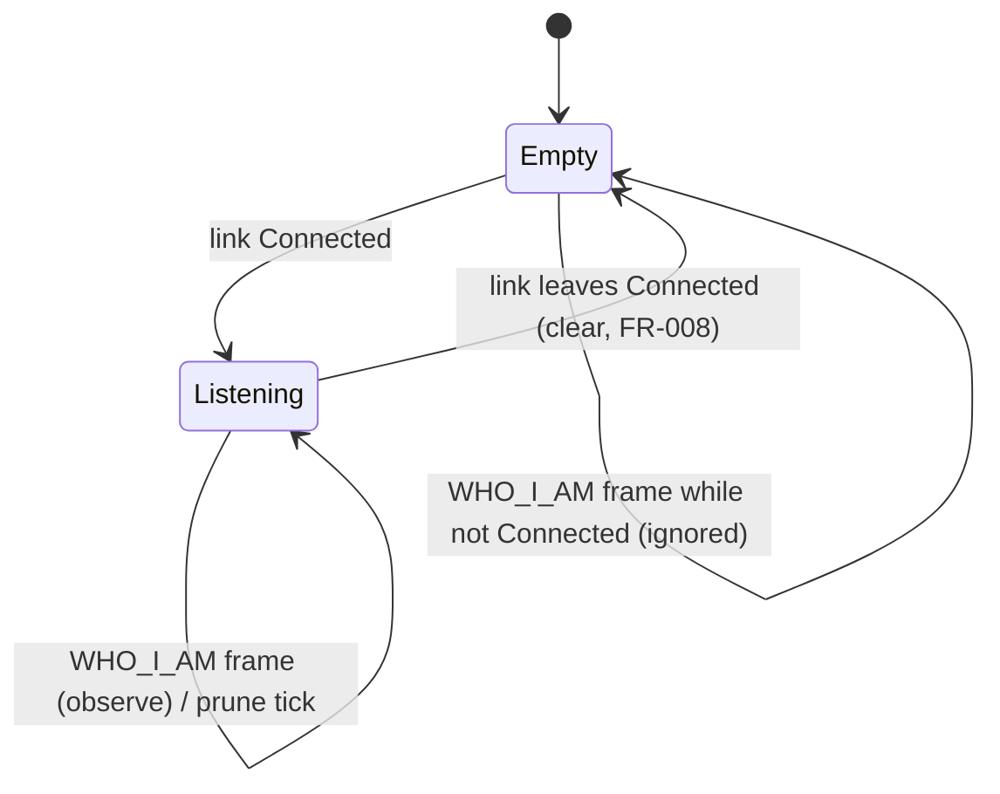

# Data Model: Panel Discovery via Passive WHO_I_AM Observation

**Phase 1 output for**: [plan.md](./plan.md)

F# types, the operations over them, their invariants, and the Lean Phase 2
theorems that mechanise those invariants. This model is baselined on the **types
already in the tree** (`src/ButtonPanelTester.Core/Can/*`, landed early under
#121) and on the firmware-verified wire format in
[contracts/who-i-am-wire-format.md](./contracts/who-i-am-wire-format.md). Each
section is tagged **shipped** (in the tree, correct), **corrected** (in the
tree, but spec-003 fixes it), or **new** (spec-003 builds it).

The lifecycle types this feature observes — `CanLinkState`, the `ICanLinkService`
contract — are owned by the CAN-link lifecycle and are **not** redefined here;
spec-003 depends on them only as the behavioural capability described in
[plan.md](./plan.md) §Relationship to spec-002.

---

## 1. WHO_I_AM frame — *corrected*

### 1.1 F# types (`src/ButtonPanelTester.Core/Can/WhoIAmFrame.fs`)

```fsharp
type PanelUuid = PanelUuid of uuid0: uint32 * uuid1: uint32 * uuid2: uint32
type FwType = FwType of uint16          // CHANGED from `FwType of byte`
type MachineTypeByte = MachineTypeByte of byte

type WhoIAmFrame =
    { MachineType : MachineTypeByte
      FwType      : FwType
      Uuid        : PanelUuid }

val parse  : ReadOnlyMemory<byte> -> WhoIAmFrame option   // None iff length <> 15 (FR-007)
val encode : WhoIAmFrame -> byte[]                        // 15-byte buffer, no padding
```

### 1.2 What changes from the shipped codec

The shipped `WhoIAmFrame.fs` encodes the wrong wire layout (it models `fwType`
as one byte at offset 1, gates on `fwType = 0x04`, reads UUIDs at 2/6/10, and
writes a padding byte at 14). The corrected codec, per the wire contract:

| Aspect | Shipped (#121) | Corrected (spec-003) |
|---|---|---|
| `FwType` carrier | `byte` | `uint16` |
| `fwType` offset/width | `[1]`, 1 byte | `[1..2]`, big-endian `UInt16` |
| `fwType` acceptance | reject if `<> 0x04` | **no gate** — informational only |
| `uuid0/1/2` offsets | `2 / 6 / 10` | `3 / 7 / 11` |
| trailing byte | padding `[14]` | UUID2's low byte (no padding) |
| `parse` rejection rule | length ≠ 15 **or** `fwType ≠ 0x04` | **length ≠ 15 only** |

`fwType` is the panel **hardware** variant (`0x0004` = 12 V, `0x000F` = 24 V),
retained as informational metadata. It is parsed and round-tripped but is **not**
surfaced in the Panels-on-bus row (the spec asks only for UUID, decoded variant
identity, and last-seen).

### 1.3 Invariant

- **Round-trip**: `parse (encode f) = Some f` for **every** `WhoIAmFrame` (no
  well-formedness precondition, since the only rejection axis — length — cannot
  be violated by `encode`, which always writes 15 bytes).
  **Lean**: `Phase2/WhoIAmFrame.lean` — `parse_encode_roundtrip` (re-stated for
  the corrected codec).

---

## 2. Variant identity — *shipped*

### 2.1 Types (`src/ButtonPanelTester.Core/Can/PanelObservation.fs`)

```fsharp
type MarketingVariant =
    | EdenXp     // machineType = 0x03
    | OptimusXp  // machineType = 0x0A
    | R3LXp      // machineType = 0x0B
    | EdenBs8    // machineType = 0x0C

type VariantIdentity =
    | Marketing of MarketingVariant
    | Virgin                  // machineType = 0xFF
    | Unknown of raw: byte    // any other value, incl. 0x08 TopLift-A

module VariantDecoder =
    val decode : MachineTypeByte -> VariantIdentity   // total
```

The decoder is unchanged and correct; the four marketing bytes and the `0xFF`
virgin marker are firmware constants confirmed in the
[firmware verification](./context/firmware-verification-2026-06-05.md). `0x08`
(TopLift-A) is out of the four-machine scope and decodes to `Unknown 0x08uy`.

### 2.2 Invariant

- **Totality**: `decode` is defined on every `byte`. **Lean**:
  `Phase2/PanelObservation.lean` — `variant_decoding_total`.

---

## 3. Panel observation — *shipped*

### 3.1 Record (`src/ButtonPanelTester.Core/Can/PanelObservation.fs`)

```fsharp
type PanelObservation =
    { Uuid            : PanelUuid
      VariantByte     : MachineTypeByte     // raw byte (FR-003 detail affordance)
      VariantIdentity : VariantIdentity     // decoded (FR-003 row label)
      LastSeen        : DateTimeOffset }     // FR-004 timestamp
```

### 3.2 Mapping rule

A `WhoIAmFrame f` received at instant `now` produces a `PanelObservation` with
`Uuid = f.Uuid`, `VariantByte = f.MachineType`,
`VariantIdentity = VariantDecoder.decode f.MachineType`, `LastSeen = now`.
`f.FwType` is intentionally not carried into the observation (not surfaced this
slice).

---

## 4. Panels-on-bus list — *shipped*

### 4.1 Map + operations (`src/ButtonPanelTester.Core/Can/PanelsOnBus.fs`, `Pruning.fs`)

```fsharp
type PanelsOnBus = Map<PanelUuid, PanelObservation>

module PanelsOnBus =
    val empty   : PanelsOnBus
    val observe : DateTimeOffset -> WhoIAmFrame -> PanelsOnBus -> PanelsOnBus
    val clear   : PanelsOnBus -> PanelsOnBus           // FR-008 link-loss

module Pruning =
    val prune   : ttl: TimeSpan -> now: DateTimeOffset -> PanelsOnBus -> PanelsOnBus
```

For spec-003, `ttl = TimeSpan.FromSeconds 15.0` (FR-005).

### 4.2 Operational semantics

- `observe now f m` inserts-or-updates `m[f.Uuid]` with a fresh
  `PanelObservation`. Existing rows have `LastSeen` advanced to `now`;
  `VariantByte`/`VariantIdentity` are re-derived from the latest frame (so a
  panel power-cycled out of `AAS_STAND_BY` mid-session is reflected accurately).
- `prune ttl now m` removes every row with `now - lastSeen > ttl`.
- `clear m` returns `empty`. Called by `PanelDiscoveryService` on a
  `Connected → ¬Connected` transition (FR-008).

### 4.3 Invariants

- **Coalescing**: `(observe now f m).Count ≤ m.Count + 1`, with equality iff
  `f.Uuid ∉ m.Keys` — same-UUID observations never duplicate a row (FR-002).
  **Lean**: `Phase2/PanelsOnBus.lean` — `observe_coalesces_by_uuid`,
  `observe_preserves_other_keys`.
- **Pruning partition**: post-prune membership iff `now - lastSeen ≤ ttl`
  (FR-005). **Lean**: `Phase2/Pruning.lean` — `prune_partitions_by_threshold`,
  `prune_idempotent`.

---

## 5. Discovery service pipeline — *new*

`PanelDiscoveryService` ships today as a parameterless **stub**: `PanelsOnBus`
returns `empty` and `PanelsOnBusChanged` never fires. Spec-003 grows it into the
live pipeline. The service is the single owner of mutable discovery state and
the merge point for three inputs.

### 5.1 Constructor dependencies (replacing the stub's parameterless ctor)

| Dependency | Port | Why |
|---|---|---|
| `ICanFrameStream` | `Core/Can/Ports.fs` (shipped) | WHO_I_AM ingest (`RawFramesReceived`) |
| `ICanLinkService` | `Services/Can/ICanLinkService.fs` (shipped) | `LinkStateChanged` → FR-008 clear |
| `IClock` | `Core/Dictionary/Ports.fs` (shipped, spec-001) | receive `now` + prune reference instant; `FrozenClock` fake in tests |

No new external boundary is introduced — all three ports and their virtual/fake
adapters already exist (Constitution Principle III is satisfied by reuse).

### 5.2 State and transitions



Held state: a single mutable `PanelsOnBus` guarded for thread-safety (the three
inputs fire on different threads — read thread, timer thread, link-emission
thread). Each input recomputes the map and publishes through
`PanelsOnBusChanged`:

- **On frame** (read thread): if the link is `Connected` and the frame matches
  `CanId = 0x1FFFFFFF ∧ Payload.Length = 15`, `parse` it; on `Some f`,
  `observe (clock.UtcNow()) f` and fire. On `None`, silent drop (FR-007). Frames
  arriving while not `Connected` are ignored.
- **On prune tick** (1 s timer): `prune 15s (clock.UtcNow())`; fire only if the
  map changed (avoids idle UI churn — backed by `prune_idempotent`).
- **On link transition** (link-emission thread): `Connected → ¬Connected` →
  `clear` and fire (FR-008, SC-004). The clear is independent of the prune
  timer, so the list empties immediately on disconnect rather than after a TTL.

### 5.3 Observable plumbing

`PanelsOnBusChanged` is a hand-rolled hot `IObservable<PanelsOnBus>` (no
`System.Reactive` dependency — matches the lifecycle service's subject style).
The shipped stub's `SubjectFanOut` has a no-op `OnNext` path and a no-op
unsubscribe; the pipeline slice makes it actually publish on each recompute and
gives subscribers a working `Dispose` (the GUI subscribes once at composition
time via `Cmd.ofSub`, so single-shot fan-out is sufficient, but unsubscribe must
not leak).

---

## 6. Cross-reference to Lean Phase 2

| Lean module | Mechanises | F# source | Spec-003 action |
|---|---|---|---|
| `Phase2/WhoIAmFrame.lean` | §1.3 round-trip | `Core/Can/WhoIAmFrame.fs` | **re-state** for corrected codec (drop `fwType = 4` precondition) |
| `Phase2/PanelObservation.lean` | §2.2 totality | `Core/Can/PanelObservation.fs` | re-point citation 002 → 003 |
| `Phase2/PanelsOnBus.lean` | §4.3 coalescing | `Core/Can/PanelsOnBus.fs` | re-point citation 002 → 003 |
| `Phase2/Pruning.lean` | §4.3 pruning partition | `Core/Can/Pruning.fs` | re-point citation 002 → 003 |

The `parse_encode_roundtrip` theorem is the only one whose **statement** changes
(the corrected codec removes its precondition); the other three are unchanged in
substance and only need their `specs/002-can-link-and-panel-discovery/…`
doc-comment citations re-pointed to `specs/003-panel-discovery/…` as 003 takes
ownership (see [plan.md](./plan.md) §Citation re-pointing).
