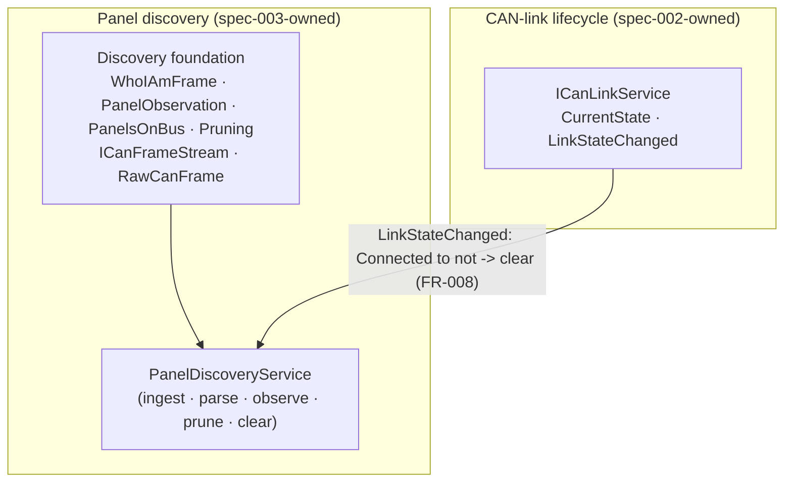

# Implementation Plan: Panel Discovery via Passive WHO_I_AM Observation

**Branch**: `docs/153-spec-003-respec` (issue-numbered working branch; speckit feature dir `specs/003-panel-discovery` pinned via `.specify/feature.json`) | **Date**: 2026-06-08 | **Spec**: [spec.md](./spec.md)

**Input**: Feature specification from [`specs/003-panel-discovery/spec.md`](./spec.md)

## Summary

Turn the merely-Connected CAN link into a working diagnostic: while the link is
`Connected`, passively observe STEM auto-address `WHO_I_AM` broadcasts on CAN ID
`0x1FFFFFFF` and render the panels heard in a UUID-keyed **Panels-on-bus** list —
UUID, the variant byte decoded to a marketing name / `virgin` / `unknown`, and
the last-seen timestamp. Coalesce by UUID (FR-002), prune after 15 s of silence
(FR-005), clear the list when the link leaves `Connected` (FR-008), and transmit
**zero** CAN frames (FR-009). This is the supplier-QA "is this pristine board
alive on the bus?" slice (SC-001: visible within 6 s).

The technical core is a **correction**, a **transport fix**, and a **pipeline**.
**Correction (Phase A — done):** the shipped `WhoIAmFrame.fs` (#121) encoded the
wrong wire layout and rejected every real frame; spec-003 re-based the codec onto the
firmware-verified format ([contracts/who-i-am-wire-format.md](./contracts/who-i-am-wire-format.md)).
**Pipeline (Phases B/C — done):** grew the stub `PanelDiscoveryService` into the live
observe → prune → clear pipeline and bound the real `PcanCanFrameStream` receive
adapter. **Transport fix (Phase R — the 2026-06-09 re-scope):** bench validation found
`WHO_I_AM` is a *segmented multi-frame* SP_APP message, not a single frame, and the
vendored receive loop was never started — so spec-003 starts the read loop and
reassembles the fragments (reusing the vendored `PacketReassembler`), then re-sources
discovery onto the reassembled feed. See
[§Re-scope](#re-scope-2026-06-09--segmented-who_i_am-transport).

This plan is **independent**: it baselines on the shipped interface contracts
(`ICanLinkService`, `IPanelDiscoveryService`, the `Core/Can` domain types and
`ICanFrameStream` port) and on firmware facts, not on the sibling specs'
planning documents. See [§Relationship to spec-002](#relationship-to-spec-002).

## Technical Context

**Language/Version**: F# on .NET 10 (`net10.0`; `net10.0-windows` only for the
PEAK adapter project, per STEM PORTABILITY).

**Primary Dependencies**: locked stack from the constitution — Avalonia 11.3.x +
Avalonia.FuncUI 1.5.x (Elmish-MVU), `Peak.PCANBasic.NET` as the physical CAN
adapter, the vendored STEM protocol stack (reassembly/chunking) consumed through
the `ICanFrameStream` port. Lean 4 (toolchain pinned in `lean/lean-toolchain`),
no mathlib.

**Storage**: none — the Panels-on-bus list is volatile and rebuilds from live
broadcasts every session (spec "no persistence" out-of-scope item).

**Testing**: xUnit 2.9.x + FsCheck.Xunit 3.3.x + Avalonia.Headless.XUnit;
manual fakes only (no Moq/NSubstitute). Virtual `InMemoryCanFrameStream` +
`FrozenClock` drive the CI test layers; PEAK-bound E2E is `Category=Hardware`.

**Target Platform**: Windows desktop (Avalonia) for the PEAK driver; all logic
projects are platform-neutral `net10.0`.

**Project Type**: desktop application, archetype A (`Core / Services /
Infrastructure / GUI` + `Tests`), cohabiting the existing CAN code.

**Performance Goals**: SC-001 pristine panel visible ≤ 6 s; SC-002 in-place
coalesce 100% (no duplicate rows); SC-003 zero frames transmitted; SC-004 list
empty by the next render after leaving `Connected`.

**Constraints**: pure observation — no CAN transmit on any path (FR-009);
15 s prune threshold (FR-005); allocation-free receive path (`RawCanFrame`
struct over pooled `ReadOnlyMemory<byte>`); one panel at a time on the bench
(assumption — but state is keyed by UUID so an accidental two-on-bus lists both).

**Scale/Scope**: a single bench panel; the `PanelsOnBus` map holds ~1 entry;
WHO_I_AM cadence is ~1 frame/panel/~6 s (the receive path is sized for the
denser transmit traffic later features add, not for this slice).

## Constitution Check

*GATE: must pass before Phase 0. Re-checked after Phase 1 design — still PASS.*

- **I. Formal Verification of Invariants** *(NON-NEGOTIABLE)* — Lean Phase 2
  modules under `lean/Stem/ButtonPanelTester/Phase2/`:
  - `WhoIAmFrame.lean` — **re-stated** for the corrected codec; theorem
    `parse_encode_roundtrip` now holds for every `WhoIAmFrame` (the dropped
    `fwType = 0x04` gate removes the old precondition).
  - `PanelObservation.lean` — `variant_decoding_total` (unchanged; citation
    re-pointed).
  - `PanelsOnBus.lean` — `observe_coalesces_by_uuid`,
    `observe_preserves_other_keys` (unchanged; citation re-pointed).
  - `Pruning.lean` — `prune_partitions_by_threshold`, `prune_idempotent`
    (unchanged; citation re-pointed).

  Order per Principle I: re-state the Lean theorem → xUnit/FsCheck → F#. No
  `sorry`, no custom axioms.

- **II. Property-Driven Correctness** — FsCheck properties in
  `tests/ButtonPanelTester.Tests/Property/Can/`:
  - `WhoIAmFrameRoundtrip`, `WhoIAmFrameRejectsWrongLength` (FR-007 — now a
    **length-only** reject; the `fwType` reject property is deleted).
  - `PanelsOnBusCoalescing`, `PanelsOnBusLastSeenMonotonic` (FR-002, FR-004).
  - `PruningCorrectness`, `PruningBoundary`, `PruningIdempotentAtSameNow`
    (FR-005). `VariantByteMappingTotal` (FR-003).
  - Service-level behaviours that cannot be expressed as a pure property —
    end-to-end ingest, link-loss clear (FR-008), the 6 s discovery window
    (SC-001) — are example-based **integration** tests over the virtual
    adapter + `FrozenClock` (one-line rationale: they assert wiring and timing
    across threads, not a pure-function law).

- **III. Ports and Adapters for Every External Boundary** — no **new** boundary;
  all three ports and their non-hardware adapters already exist:

  | Port | Production adapter | Virtual / fake adapter |
  |---|---|---|
  | `ICanFrameStream` (`Core/Can/Ports.fs`) | `PcanCanFrameStream` (shipped C1/C2 — raw frame source) | `InMemoryCanFrameStream` (shipped) |
  | `IWhoIAmObserver` (new — R2) | WHO_I_AM reassembly adapter (new — R2, layered over `ICanFrameStream`) | trivial in-memory fake, or drive the real adapter with `InMemoryCanFrameStream` |
  | `ICanLinkService` (`Services/Can/ICanLinkService.fs`) | `CanLinkService` (shipped) | `InMemoryCanLink`-backed (shipped) |
  | `IClock` (`Core/Dictionary/Ports.fs`) | `SystemClock` (`Infrastructure/Clock.fs`, shipped) | `FrozenClock` (`Tests/Fakes/Wiring.fs`, shipped) |

  The re-scope also fixes a port-correctness gap in the vendored `CanPort`
  (`Infrastructure.Protocol`, C#): it reports `Connected` but never starts the receive
  loop on a clean open (R1). That is a C# transport fix, not a new port.

- **IV. CI Greens the Whole Stack; Hardware Tests Are Explicit** — (a) unit +
  property + integration + Avalonia.Headless GUI layers all extended; (b) the
  one new `Category=Hardware` E2E (`DiscoveryHardwareTests`) is tagged and
  excluded from default CI, tracked by the existing CAN-hardware suite issue
  (#112 or its successor — confirm at tasks time); (c) no `[<Fact(Skip = …)>]`
  introduced.

- **V. Supplier-Deployed Identity Is Hashed at Capture** *(NON-NEGOTIABLE)* —
  **No identity-bearing data on this feature's path.** Observed UUIDs are panel
  hardware device identifiers (not OS user / machine / SID / MAC) and live only
  in volatile UI memory; nothing crosses to STEM-controlled storage (R8).

- **VI. Stopgap Discipline** — **No new stopgap.** The wire-format correction is
  a bug fix, not a knowingly-deferred bypass. The vendored protocol stack is
  repo-level shared infrastructure under its own existing waiver (#111). The
  Phase-R read-loop fix (R1) **does** modify the vendored `CanPort.ConnectAsync`
  + `PCANManager.StartReading` (idempotency guard) — a bug fix to the vendored
  receive path under that same waiver (it makes the advertised `PacketReceived`
  event actually fire on a clean open), not a new bypass. Otherwise spec-003
  consumes the stack through `ICanFrameStream` + the reused `PacketReassembler`.

**Result: PASS.** Complexity Tracking is empty.

## Project Structure

### Documentation (this feature)

```text
specs/003-panel-discovery/
├── spec.md                         # approved (do not regenerate)
├── plan.md                         # this file
├── research.md                     # Phase 0 — R1..R8, grounded in shipped code + firmware
├── data-model.md                   # Phase 1 — F# types (corrected WhoIAmFrame) + service pipeline
├── contracts/
│   ├── who-i-am-wire-format.md     # Phase 1 — firmware-verified wire format (supersedes #121 codec)
│   └── can-frame-stream-port.md    # Phase 1 — ICanFrameStream port contract
├── quickstart.md                   # Phase 1 — developer + bench onboarding
├── checklists/requirements.md      # spec quality checklist (approved)
└── context/                        # source material — NOT live spec
    ├── firmware-verification-2026-06-05.md
    └── previous-003/               # archived prior draft (frozen, do not edit)
```

### Source code (repository root) — archetype A, cohabiting the CAN code

```text
src/
├── ButtonPanelTester.Core/Can/                     net10.0          (shipped under #121)
│   ├── WhoIAmFrame.fs            CORRECT  fwType uint16 BE @[1..2]; UUID @3/7/11; no padding; length-only reject
│   ├── PanelObservation.fs       shipped  (re-point Lean citation only)
│   ├── PanelsOnBus.fs            shipped
│   ├── Pruning.fs               shipped  (re-point doc citation 002 -> 003)
│   └── Ports.fs                 shipped  (re-point RawCanFrame doc citation 002 -> 003)
├── ButtonPanelTester.Services/Can/                 net10.0
│   └── PanelDiscoveryService.fs  GROW     stub -> live pipeline (ingest/parse/observe/prune/clear); real ctor
├── ButtonPanelTester.Infrastructure/Can/           net10.0-windows
│   └── PcanCanFrameStream.fs     NEW      ICanFrameStream production adapter
└── ButtonPanelTester.GUI/                          net10.0-windows
    ├── Composition/CompositionRoot.fs   EXTEND  bind PcanCanFrameStream (drop NoOpCanFrameStream); wire service ctor
    ├── Can/PanelsOnBusView.fs           NEW     list view + empty-state explainer (FR-006)
    └── App.fs                           EXTEND  fill the third vertical slot (PanelsOnBus row) via Cmd.ofSub

tests/
├── ButtonPanelTester.Tests/                        net10.0
│   ├── Property/Can/*               CORRECT/EXTEND   WhoIAm round-trip + length-reject; PanelsOnBus; Pruning; VariantDecoder
│   ├── Fixtures/Can/whoIAmFixtures.json  REBUILD     correct layout; >=1 real bench capture; +24 V; +TopLift-A; -wrong-fwtype
│   ├── Fakes/Can/InMemoryCanFrameStream.fs  shipped
│   └── Integration/Can/             NEW   DiscoveryE2ETests, PruningE2ETests, LinkLossClearsListTests
└── ButtonPanelTester.Tests.Windows/                net10.0-windows
    ├── Gui/Can/PanelsOnBusViewTests.fs          NEW  Avalonia.Headless snapshot
    └── Integration/Can/Hardware/DiscoveryHardwareTests.fs  NEW  Category=Hardware

lean/Stem/ButtonPanelTester/Phase2/                 (shipped under #121)
├── WhoIAmFrame.lean      RE-STATE  corrected round-trip (drop fwType=4 precondition)
├── PanelObservation.lean re-point citation 002 -> 003
├── PanelsOnBus.lean      re-point citation 002 -> 003
└── Pruning.lean          re-point citation 002 -> 003
```

**Structure Decision**: archetype A, unchanged. The discovery code cohabits the
CAN projects; the documentation seam (specs) is independent of the code seam.
After #197 the discovery surface is its own `IPanelDiscoveryService` /
`PanelDiscoveryService` (no longer folded into `CanLinkService`), so the pipeline
grows inside that service without touching the lifecycle service.

## Relationship to spec-002

Spec-003 and the CAN-link lifecycle (historically spec-002) share code but split
cleanly along ownership:



- **003 depends on 002's lifecycle** as a behavioural capability: it observes
  only while `Connected` and clears on any `Connected → ¬Connected` transition,
  consuming `ICanLinkService.LinkStateChanged` / `CurrentState`. It does not
  depend on how the link is established or which feature delivered it (R6). The
  edge is one-directional — nothing in the lifecycle service references
  discovery.

- **003 owns the discovery foundation.** `WhoIAmFrame`, `PanelObservation`,
  `PanelsOnBus`, `Pruning`, and the `ICanFrameStream` / `RawCanFrame` receive
  port are discovery-domain types. They shipped **early**, under 002's Phase 2
  (#121), before the spec split — but they are spec-003's to specify and
  maintain. This plan, `data-model.md`, and the two contracts are now their
  canonical documentation.

- **Do not inline-rewrite spec-002's canonical docs.** Some spec-002 documents
  still describe the discovery foundation and the (wrong) wire format as their
  own. Those stale statements are logged on the spec-002 supersede carrier
  **#190**; correcting them happens there, under #190's don't-inline-rewrite
  discipline — **not** by editing spec-002's `spec.md` / `plan.md` from this
  branch. The code-side counterpart of this ownership transfer is the citation
  re-pointing below.

## Citation re-pointing

As 003 takes documentation ownership of the discovery foundation, the discovery
components' doc-comments that still cite the pre-split combined spec
`specs/002-can-link-and-panel-discovery/…` are re-pointed to
`specs/003-panel-discovery/…`. These are comment-only edits; each rides with the
implementation slice that already touches its file (never a standalone "fix
comments" commit, per `vertical-commits`):

| File | Current (stale) citation | Re-point to | Rides with |
|---|---|---|---|
| `Core/Can/Pruning.fs` | `specs/002-can-link-and-panel-discovery/data-model.md` §5.2 | `specs/003-panel-discovery/data-model.md` §4 | Phase A |
| `Core/Can/Ports.fs` (`RawCanFrame`) | `specs/002-can-link-and-panel-discovery/contracts/can-frame-stream-port.md` | `specs/003-panel-discovery/contracts/can-frame-stream-port.md` | Phase B |
| `Phase2/PanelObservation.lean` | `specs/002-can-link-and-panel-discovery/data-model.md` §3.2 | `specs/003-panel-discovery/data-model.md` §2 | Phase A |
| `Phase2/PanelsOnBus.lean` | `specs/002-can-link-and-panel-discovery/data-model.md` §5.4 | `specs/003-panel-discovery/data-model.md` §4 | Phase A |
| `Phase2/Pruning.lean` | `specs/002-can-link-and-panel-discovery/data-model.md` §5.4 | `specs/003-panel-discovery/data-model.md` §4 | Phase A |

Borderline (not in the required set, decide at tasks time):
`Services/Can/PanelDiscoveryService.fs` cites `specs/002-can-link-lifecycle/research.md`
R4 for the hand-rolled-subject pattern. That pattern is now also documented in
this spec's [research.md](./research.md) R5; re-point it to R5 when Phase B edits
the file, unless the lifecycle citation is preferred as the pattern's origin.
(`ICanLinkService.fs`'s own `specs/002-can-link-lifecycle/…` citations are
lifecycle-owned and stay.)

## Re-scope (2026-06-09) — segmented WHO_I_AM transport

Bench validation after Phase C (CI-green) found spec-003's receive model wrong on
real hardware. `WHO_I_AM` is **not** a single 15-byte frame: it is a segmented STEM
SP_APP message — several classic-CAN frames on `0x1FFFFFFF`, each with a 2-byte
`NetInfo` header — reassembled into a `[header][15-byte payload][CRC16]` packet (see
[contracts/who-i-am-wire-format.md](./contracts/who-i-am-wire-format.md)). Two
findings, both bench-proven:

1. **Dead read loop.** `CanPort`/`PCANManager` report `Connected` but never start the
   receive loop on a clean open, so nothing is received. A direct `StartReading()`
   makes the frames flow.
2. **Wrong source.** Discovery tapped the raw single-frame `ICanFrameStream` feed; it
   must consume the **reassembled** payload. The existing vendored
   `Services.Protocol.PacketReassembler` already rebuilds it (no new reassembly code).

Decision (with the operator): a small fix, **not** the long F# `Stem.Communication`
rewrite (vendored-stack removal #111 stays future). Reading is spec-003's domain per
the #151 split (lifecycle/spec-002 polls `GetStatus` and never reads), so the
read-loop fix is folded into spec-003 (mis-framed bug #203 closed not-planned). The
correction is the **Phase R** slices below.

**Live-boundary (Constitution IV).** *What boundary does this exercise that the unit
suite cannot?* The real PEAK receive path + multi-frame reassembly. In-CI proxy:
synthetic transport fixtures (R2) over `InMemoryCanFrameStream`. Conclusive proof: the
**Phase E** bench E2E (operator/bench follow-up — GitHub Actions cannot reach the PEAK
hardware). Per the Validation Gate, CI-green is *code-complete*; the bench E2E is the
*done* line, and the feature is `ValidationPending` until it passes.

## Implementation phases

Ordered, each a bisect-safe vertical slice (`bisect-safe` + `vertical-commits`).
Phases A–C landed and are CI-green; the **Phase R** re-scope corrects the receive
path; D–E follow. `/speckit-tasks` expands these into `tasks.md`.

- **Phase A — Correct the WHO_I_AM wire foundation.** *(DONE — Checkpoint A.)*
  `Phase2/WhoIAmFrame.lean` re-stated; `whoIAmFixtures.json` rebuilt (real
  `virgin_panel_12v` anchor); `WhoIAmFrame.fs` corrected (`fwType` u16 BE @[1..2],
  UUID @3/7/11, length-only reject). Still valid — the codec parses the reassembled
  15-byte payload.

- **Phase B — Discovery pipeline.** *(DONE — Checkpoint B; RE-SOURCED by R3.)* Grew
  `PanelDiscoveryService` stub → live (observe/prune/clear; FR-002/004/005/008) with
  `DiscoveryE2ETests` / `PruningE2ETests` / `LinkLossClearsListTests`. The
  coalesce/prune/clear logic stays; R3 swaps the **input** from the raw
  `ICanFrameStream` + inline `CanId/length` filter to the reassembled `IWhoIAmObserver`
  feed.

- **Phase C — Production adapter + composition.** *(DONE — Checkpoint C.)*
  `PcanCanFrameStream` + `CanPortShare` (C1); `CompositionRoot` binds the real receive
  graph, `NoOpCanFrameStream` dropped (C2). `PcanCanFrameStream` is **kept** as the raw
  `ICanFrameStream` source feeding the R2 reassembly adapter.

- **Phase R — Receive-path re-scope.** *(NEW — bench-driven; CI-provable with synthetic
  multi-frame fixtures; prerequisite for real-hardware discovery.)* Three slices:
  - **R1 — read-loop activation** (`Infrastructure.Protocol`, C#): `CanPort.ConnectAsync`
    starts the driver reading on connect, **idempotent** (the reconnect paths already
    call `StartReading`; guard the `_readTask`); expose `StartReading` on `IPcanDriver`.
    RED: a fake-driver test asserting connect triggers reading exactly once, no
    double-start on reconnect. *(Folds in closed #203.)*
  - **R2 — WHO_I_AM reassembly adapter + port** (`Infrastructure/Can`, F#): a new
    `IWhoIAmObserver` port + an adapter consuming raw `ICanFrameStream`, reusing
    `PacketReassembler` + `PacketDecoder` offsets (filter `0x1FFFFFFF` → reassemble →
    `cmd 0x0024` → extract `[9 .. len-2]` → `WhoIAmFrame.parse` → emit). Unit tests over
    the transport fixtures (real 5-frame split, missing-fragment, wrong-command,
    interleaved-`PacketId`).
  - **R3 — re-source discovery**: `PanelDiscoveryService` ctor takes `IWhoIAmObserver`
    (was `ICanFrameStream`); drop the inline `CanId/length` filter (the adapter owns it);
    rewire `CompositionRoot`; rework the B1/B2/B3 E2E setups to drive multi-frame input
    (or a fake `IWhoIAmObserver`). Coalesce/prune/clear assertions unchanged.

- **Phase D — GUI.** *(PENDING.)* `PanelsOnBusView` (UUID, decoded variant + raw-byte
  detail affordance, last-seen) + empty-state explainer distinguishing "link down" from
  "link up, nothing announcing" (FR-006); fill `App.fs`'s third vertical slot via
  `Cmd.ofSub`; Avalonia.Headless snapshot. Binds `PanelsOnBusChanged` — now carrying
  real rows.

- **Phase E — Hardware E2E + bench validation.** *(PENDING — the Validation Gate.)* A
  committed `Category=Hardware` receive E2E (seeded by the throwaway
  `PanelDiscoverySmoke.fs`): a real virgin panel appears within 6 s with zero frames
  transmitted (SC-001/SC-003) over the full read-loop → reassemble → discovery chain.
  Linked to the CAN-hardware tracker. The live-boundary proof CI cannot run.

## Complexity Tracking

> Empty — no new stopgaps, no unresolved Constitution gate. The shared vendored
> protocol stack is the only stopgap in scope and is inherited, not introduced.

## Tooling note

The working branch is `docs/153-spec-003-respec` (issue-numbered), which does not
match speckit's branch-prefix → spec-dir convention. `.specify/feature.json`
(`{"feature_directory": "specs/003-panel-discovery"}`) pins the feature dir so
`get_feature_paths` resolves correctly and skips branch-name validation.

`jq` (1.8.1) is installed on this machine, so `common.sh` parses `feature.json`
and the speckit bash scripts resolve `specs/003-panel-discovery` directly — no
env var needed. (Historical note: `python3` here is the non-functional Windows
Store stub, which shadows the parser's grep/sed fallback; `jq` is first in the
parser order, so this no longer matters. If `jq` is ever unavailable, override
with `SPECIFY_FEATURE_DIRECTORY=specs/003-panel-discovery`.)

## Status

*Created 2026-06-08 as a fresh, independent plan for the re-spec under #153.*

### Completed (this run — `/speckit-plan`)

- Phase 0 — `research.md` (R1–R8) grounded in shipped contracts + firmware.
- Phase 1 — `data-model.md`, `contracts/{who-i-am-wire-format,can-frame-stream-port}.md`,
  `quickstart.md`. Constitution Check PASS (no Complexity Tracking).

### Next

- `/speckit-tasks` → `tasks.md` (expands Phases A–E; Phase A first).
- Optional `/speckit-checklist`, `/speckit-analyze` before `/speckit-implement`.

### Shipped foundation (under #121, before this spec)

`WhoIAmFrame.fs` (codec — to be corrected), `PanelObservation.fs`,
`PanelsOnBus.fs`, `Pruning.fs`, `Ports.fs` (`RawCanFrame` + `ICanFrameStream` +
`ICanLink`), `InMemoryCanFrameStream`, four Phase-2 Lean theorems, four discovery
FsCheck suites, WHO_I_AM fixtures (to be rebuilt). `PanelDiscoveryService` +
`IPanelDiscoveryService` shipped as a stub under #197.
