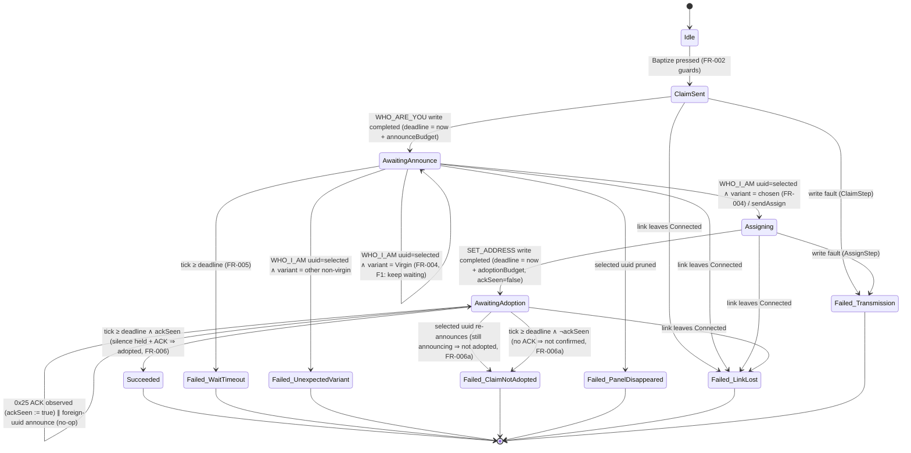

# Data Model Delta: Baptism Confirmation-Model Rework (F1 + F6)

**Parent**: [../spec.md](../spec.md) (Clarifications session 2026-06-17) ·
[../data-model.md](../data-model.md) (frozen trace of the shipped model) ·
[plan.md](./plan.md) | **Date**: 2026-06-17

This delta **supersedes** §4.1 / §4.2 / §4.3 / §4.4 / §8 of the parent `data-model.md` for the
baptism attempt FSM. The parent stays frozen as the record of what children #213–#217 shipped
(success on SET_ADDRESS write-completion); this file is the **target** the rework child implements.
Everything not restated here (codecs §2, BoardVariant §1, enablement §6, audit §7, reset §5) is
unchanged. Type/case names mirror Lean (stem-fp §10); the closed-DU triple (Lean + FsCheck +
XML-doc) applies to every changed DU (stem-fp §3).

## Why the shipped model was wrong (evidence)

Bench (`v04test2`–`v04test5`) + a firmware re-read (`AutoAddressSlave.c`, `SP_Application.c`)
proved two defects and refuted the "no reply ever comes" assumption:

- **F1 (false failure)** — `AwaitingAnnounce` terminated a transient virgin (`0xFF`) re-announce as
  `UnexpectedVariant`. The firmware gates the claim on **fwType only** (`AutoAddressSlave.c:237`),
  no variant gate — so a virgin announce is just the panel still mid-cycle, not a rejection.
- **F6 (false success)** — success was reported on SET_ADDRESS write-completion; an F6 panel
  completed the write yet kept announcing (never adopted). **Silence ⟺ adoption is deterministic**:
  a panel broadcasts WHO_I_AM only in `AAS_STARTUP`/`AAS_ANSWER_TO_MASTER`; `AAS_STAND_BY` (silent)
  is entered only on the UUID-matched SET_ADDRESS branch. The dispatcher ACKs `0x25` for any
  fully-received SET_ADDRESS (handler returns true regardless of match), so the `0x25` ACK is a
  fast positive precursor and **silence is authoritative**.

## §4.1 — Corrected states & transitions

New state **`AwaitingAdoption`** sits between `Assigning` and `Succeeded`: the assign write
completing no longer succeeds the attempt — it opens the adoption-confirmation window.



Notes (deltas to the parent §4.1 notes):

- **F1 fix** — in `AwaitingAnnounce`, `announcementHeard(selectedUuid, variant)` branches three ways
  on the shipped `VariantIdentity` (`Marketing | Virgin | Unknown of raw`):
  `Marketing chosen` → `Assigning`; `Virgin` → stay (not adopted yet); `Marketing other | Unknown _`
  → `UnexpectedVariant`. A foreign uuid is still a strict no-op.
- **F6 fix** — `Assigning` on write-complete → `AwaitingAdoption` (not `Succeeded`). Success is
  reached only from `AwaitingAdoption` when the adoption window elapses **with** `ackSeen` true and
  **no** selected-uuid re-announce having broken the silence. A selected-uuid re-announce during the
  window → `ClaimNotAdopted` deterministically (FR-006a). The "silence held but no ACK" tick →
  `ClaimNotAdopted` too (strict: never a false success; safe per the dropped-ACK edge case — a
  re-baptize of an already-adopted panel is harmless).
- `panelsChanged false` in `AwaitingAdoption` is a no-op: the panel announced <`adoptionBudget` ago
  (the match), so it cannot prune (15 s) inside the window; silence is measured by the absence of
  `announcementHeard`, not by pruning.
- Terminal-state idempotence and the never-flip-a-failure rule are unchanged.

## §4.2 — Outcome type (now seven, FR-005/FR-006a)

```fsharp
type BaptismOutcome =
    | Succeeded                                  // FR-006: confirmed adoption (ACK + silence)
    | WaitTimeout                                // FR-005 (announce phase)
    | UnexpectedVariant of announced: VariantIdentity   // only a different NON-virgin variant
    | ClaimNotAdopted                            // NEW, FR-006a: still announcing after assign / no ACK
    | PanelDisappeared
    | LinkLost
    | TransmissionFailure of step: SequenceStep

type SequenceStep = ClaimStep | AssignStep
```

`ClaimNotAdopted` carries no payload — its guidance (Reset-to-virgin → re-baptize, FR-015) is
fixed. Closed-DU triple: add the `claimNotAdopted` case to Lean `BaptismOutcome`, extend the
FsCheck outcome-coverage, update the XML-doc citation in the same commit (stem-fp §3 update
protocol).

## §4.3 — Events (one new)

Add to `BaptismEvent`:

| Event | Source observable | Used in states |
|---|---|---|
| `SetAddressAcked` | **NEW** RX observation of the `0x25` application ACK addressed to the tool | `AwaitingAdoption` |

The existing events (`AnnouncementHeard`, `Tick`, `PanelsChanged`, `LinkChanged`,
`WriteCompleted`, `WriteFaulted`) are unchanged. `AnnouncementHeard` is now consumed in
`AwaitingAdoption` too (a selected-uuid announce there means "not adopted").

## §4.4 — Post-success watch → folded into the success gate (FR-007)

The shipped §4.4 declared `Succeeded` on write-completion, then watched for a re-announce within the
15 s prune window. **Corrected**: the silence wait is now part of reaching `Succeeded`
(`AwaitingAdoption`), so the watch moves *upstream* of success. A **residual backstop** is retained
(defense in depth): after `Succeeded`, if the claimed uuid is heard announcing within the prune
window, raise a claim-did-not-take **regression warning**. Expected never to fire given the gate;
volatile, no persistence (FR-013); a new attempt or link loss cancels it.

## Budgets

- `announceBudget` = 6 s (settled pin, unchanged — anchored at claim-write completion).
- `adoptionBudget` = **NEW**, one worst-case announce period (~6 s) — anchored at SET_ADDRESS
  write completion. A panel that adopted is silent immediately; the window only has to outlast one
  announce period to prove the silence is real, not a gap between announcements.
- SC-001's definitive-outcome bound = `announceBudget + adoptionBudget` (the two waits are
  sequential).

## §8 — Lean Phase 3 theorem index (deltas)

| Module | Theorem | Change |
|---|---|---|
| `BaptismSequence.lean` | `baptize_progress` | **Restated**: `Succeeded` iff claim writes complete, a matching (chosen-variant) WHO_I_AM arrives within `announceBudget`, the assign writes complete, **the `setAddressAcked` event is observed, and silence holds** (no selected-uuid announce) until a tick past the adoption deadline. The successful-trace shape gains the adoption window + the ACK pivot. |
| `BaptismSequence.lean` | `baptize_outcome_total` | **Extended** to seven outcomes; `closingSchedule` for `AwaitingAdoption` drives it to terminal (ackSeen ⇒ `Succeeded`, else `ClaimNotAdopted`). |
| `BaptismSequence.lean` | `no_assignment_without_match` | **Unchanged** — `sendAssign` still only from the `AwaitingAnnounce` validated-match arm. |
| `BaptismSequence.lean` | `virgin_keeps_waiting` (NEW) | In `AwaitingAnnounce`, `announcementHeard(selectedUuid, Virgin)` is a no-op (F1); `UnexpectedVariant` fires only on `Marketing other`/`Unknown`. |
| `BaptismSequence.lean` | `no_success_without_adoption` (NEW, or a corollary of `baptize_progress`) | `Succeeded` is unreachable without both `setAddressAcked` and the held-silence tick — the formal carrier of "never a false success on write-completion". |

`#print axioms` on each must stay ⊆ {`propext`, `Classical.choice`, `Quot.sound`}; no `sorry`.
