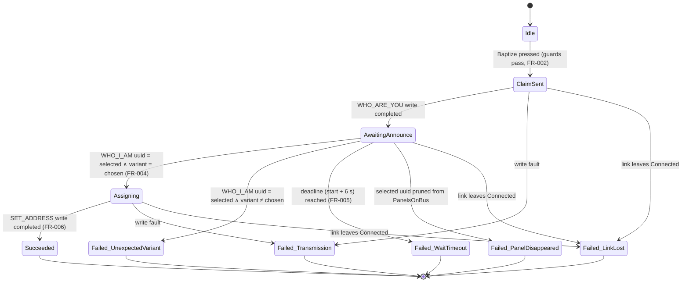

# Data Model: Baptism Workflow

**Spec**: [spec.md](./spec.md) | **Plan**: [plan.md](./plan.md) | **Date**: 2026-06-11

F# types live under `src/ButtonPanelTester.Core/Can/` unless noted; Lean mirrors under
`lean/Stem/ButtonPanelTester/Phase3/`. Wire layouts are normative in
[contracts/master-sequence-wire-format.md](./contracts/master-sequence-wire-format.md).

## 1. BoardVariant (spec Key Entity → existing `MarketingVariant`)

The spec's BoardVariant maps onto the **shipped** `MarketingVariant` DU
(`PanelObservation.fs`): `EdenXp (0x03) | OptimusXp (0x0A) | R3LXp (0x0B) | EdenBs8 (0x0C)`.
Spec-004 adds the **encode inverse** (variant → machine-identity byte) — total on the four cases
by construction, the partial inverse of the shipped total decoder
(`variant_decoding_total`, Phase 2).

- Fixed, built-in set (spec assumption); no fifth variant, no user-defined variant (FR-001).
- The virgin identity marker `0xFF` is **not** a BoardVariant — it is the reset target only
  (FR-008); the baptize picker never offers it.

**Lean**: `encodeVariant` + `encode_decode_inverse` rides in `Phase3/WhoAreYouFrame.lean` (the
byte enters the wire there).

## 2. TX codecs

### 2.1 `WhoAreYouFrame` (new, 4 B)

| Field | Type | Wire | Source |
|---|---|---|---|
| `MachineType` | `byte` | `[0]` | chosen variant's identity byte, or `0xFF` for reset |
| `FwType` | `uint16` | `[1..2]` BE | selected panel's announced fwType (baptize) / known constant (reset) |
| `Reset` | `bool` | `[3]` (`0x01`/`0x00`) | **always set** in this feature (FR-003, FR-008) |

`encode : WhoAreYouFrame -> byte[4]`; `parse : bytes -> WhoAreYouFrame option` (length-only
reject, house codec style). **Invariants**: `encode_length` (always 4 B);
`parse_encode_roundtrip`.

### 2.2 `SetAddressFrame` (new, 16 B)

| Field | Type | Wire | Source |
|---|---|---|---|
| `Uuid` | `PanelUuid` (3 × `uint32`) | `[0..11]` | byte-echo of the validated WHO_I_AM (R1) |
| `SpAddress` | `uint32` | `[12..15]` BE | computed, §2.3 |

**Invariants**: `encode_length` (always 16 B); `parse_encode_roundtrip` — which yields the
**byte-echo guarantee**: encoding the UUID parsed from a WHO_I_AM reproduces the announced bytes
verbatim, so the slave's word-equality check compares identical byte sequences
(`SetAddressEchoesAnnouncedUuidBytes` property).

### 2.3 SP_Address computation (pure function)

`spAddress network machineType fwType boardNumber = (network <<< 24) ||| (machineType <<< 16) ||| ((fwType &&& 0x3FFus) <<< 6) ||| (boardNumber &&& 0x3Fuy)`

This feature always calls it as `spAddress 0uy variantByte announcedFwType 1uy` (board 1, spec
assumption). Cross-checked: EDEN-XP/12 V/board 1 → `0x00030101` = shipped `DeviceVariantConfig`
"Keyboard 1" constant (R3).

## 3. `PanelObservation` extension (spec-003-owned type, additive)

`+ FwType: uint16` — carried through from the already-parsed `WhoIAmFrame` at observe time;
latest announcement wins (same as every other field under coalescing). **Unchanged**: UUID
keying, coalesce, prune, clear semantics; the Phase 2 Lean models (`PanelsOnBus`, `Pruning`) key
on uuid/lastSeen and are unaffected. Rationale and rejected alternative: research R2.

## 4. Baptism attempt (FSM)

One technician-initiated claim of the selected panel as the chosen variant. At most one attempt
runs at a time (the surface is modal while running); the tool holds **no** memory between
attempts (FR-013).

### 4.1 States and transitions



Notes:

- Announcements from a **foreign UUID never transition** the FSM (spec edge case; property
  `ForeignUuidNeverSatisfiesWait`).
- `Failed_WaitTimeout` carries the late-re-announcement guidance verbatim from FR-005 /
  clarification 4: claim may be incomplete; the panel may re-announce late with the target
  variant; re-run Baptize (or Reset) to recover. The tool **never** flips a reported failure to
  success.
- No automatic retry on any failure (spec edge case "Transmission failure").

### 4.2 Outcome type (exactly six, FR-005)

```fsharp
type BaptismOutcome =
    | Succeeded                                  // FR-006 message: panel goes silent by design
    | WaitTimeout                                // recovery guidance, clarification 4
    | UnexpectedVariant of announced: VariantIdentity
    | PanelDisappeared
    | LinkLost
    | TransmissionFailure of step: SequenceStep  // which send failed (FR-005)

type SequenceStep = ClaimStep | AssignStep
```

Each failure rendering names: the step that failed, the panel's likely state, the recommended
next action (FR-005). **Lean**: `baptize_outcome_total`, `baptize_progress`,
`no_assignment_without_match` in `Phase3/BaptismSequence.lean` over this exact state space.

### 4.3 FSM inputs (events)

| Event | Source observable | Used in states |
|---|---|---|
| `AnnouncementHeard of WhoIAmFrame` | `IWhoIAmObserver.WhoIAmObserved` | `AwaitingAnnounce` (+ FR-007 watch) |
| `Tick of now` | `IClock` + service timer (FrozenClock-testable) | `AwaitingAnnounce` |
| `PanelsChanged of PanelsOnBus` | `IPanelDiscoveryService` | `AwaitingAnnounce` |
| `LinkChanged of CanLinkState` | `ICanLinkService.LinkStateChanged` | all non-terminal |
| `WriteCompleted / WriteFaulted` | `IMasterSequenceTransmitter` task result | `ClaimSent`, `Assigning` |

Thread-safety: events arrive from observer threads and the UI thread; the service serializes
transitions under a lock with terminal-state idempotence (a terminal state ignores all further
events), per the STEM async/thread-safety discipline.

### 4.4 Post-success watch (FR-007)

After `Succeeded`, the service watches `IWhoIAmObserver` for the claimed UUID for one pruning
window (15 s, spec-003 constant). If heard → raise the claim-did-not-take warning. Volatile
in-memory only (FR-013); a new attempt or link loss cancels the watch.

## 5. Reset attempt

No selection required, no list anchor (FR-008). Linear flow, no announcement wait:

`Requested → ConfirmationShown → (Declined ⊣ nothing transmitted, FR-009/SC-006-logged) |
Confirmed → Broadcasting → (Sent | TransmissionFailure | LinkLost)`

- `Broadcasting` = `WHO_ARE_YOU(0xFF, fwType, reset=1)` once per known fwType
  (`0x0004`, `0x000F`) — one technician action, success when **all** writes complete (R2,
  FR-010). The success message sets the FR-010/acceptance-2.5 expectation honestly: command(s)
  written; a matching panel, if present, re-announces as virgin within ~6 s.
- Outcome type: `ResetOutcome = Sent | Declined | ResetLinkLost | ResetTransmissionFailure`.

## 6. Enablement predicates (pure, Core)

```fsharp
// Baptize: Connected ∧ exactly one announcing ∧ that panel selected (FR-002)
baptizeEnablement : CanLinkState -> announcingCount: int -> selection: PanelUuid option -> Enablement
// Reset: Connected ∧ at most one announcing (FR-008)
resetEnablement   : CanLinkState -> announcingCount: int -> Enablement

type Enablement = Enabled | Disabled of explanation: string
```

`Disabled` always carries the unmet-condition explanation (FR-002/FR-008; guards count
**announcing** panels only — silent panels are invisible by construction, spec assumption).
**Lean**: `baptize_enabled_iff`, `reset_enabled_iff` in `Phase3/Enablement.lean`; FsCheck
`EnablementGuards` gives SC-005.

## 7. Audit record (FR-012, structured log)

One record per attempt — including declined resets (SC-006) — via `ILogger<BaptismService>`
structured fields (house pattern, R8):

| Field | Baptize | Reset |
|---|---|---|
| `Action` | `"Baptize"` | `"Reset"` |
| `Variant` | marketing name | `-` |
| `PanelUuid` | selected uuid | `-` (broadcast; uuid unknown) |
| `Outcome` | one of §4.2 | one of §5 |
| `StepReached` | claim sent / announce seen / address assigned | confirmation / broadcast |
| `StartedAt` / `CompletedAt` | ISO-8601 (`IClock`) | ISO-8601 (`IClock`) |

No operator attribution (clarification 5; joins spec-007). No other persistence (FR-013).

## 8. Lean Phase 3 theorem index

| Module | Theorem | Mechanises |
|---|---|---|
| `WhoAreYouFrame.lean` | `parse_encode_roundtrip`, `encode_length`, `encode_decode_inverse` | §2.1, §1 |
| `SetAddressFrame.lean` | `parse_encode_roundtrip`, `encode_length` | §2.2 (byte-echo corollary) |
| `BaptismSequence.lean` | `baptize_progress` | §4.1 — Succeeded **iff** matching WHO_I_AM within budget + writes complete |
| `BaptismSequence.lean` | `baptize_outcome_total` | §4.2 — every run terminates in exactly one of six outcomes |
| `BaptismSequence.lean` | `no_assignment_without_match` | FR-004 — assign action unreachable without validated match |
| `Enablement.lean` | `baptize_enabled_iff`, `reset_enabled_iff` | §6 — FR-002 / FR-008 |
