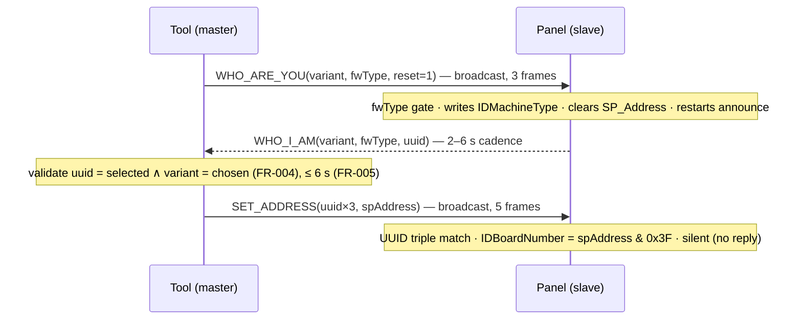

# Implementation Plan: Baptism Workflow — Claim and Reset Panels on the Bus

**Branch**: `004-baptism-workflow` | **Date**: 2026-06-11 | **Spec**: [spec.md](./spec.md)

**Input**: Feature specification from [`specs/004-baptism-workflow/spec.md`](./spec.md) |
**Epic**: [#212](https://github.com/luca-veronelli-stem/button-panel-tester/issues/212) (v0.4.0)

## Summary

Give the supplier bench its gate feature: claim ("baptize") a virgin announcing panel as one of
the four marketed BoardVariants, or reset a claimed panel back to virgin — via the **complete
three-step auto-address master sequence** (FR-003): broadcast `WHO_ARE_YOU(variant, fwType,
reset=1)`, wait ≤ 6 s for the selected panel's `WHO_I_AM` carrying the chosen variant (FR-004/005),
then broadcast `SET_ADDRESS(uuid, spAddress)`. This is the **first feature that transmits on the
CAN bus** (FR-014): it introduces the product's first TX port. Reset is a confirmation-gated
broadcast (FR-008/009) reported on write completion (FR-010). Every attempt writes one structured
audit record (FR-012); no per-panel state persists (FR-013).

The technical core: a small **wire foundation** (two TX codecs, firmware-verified in
[research.md](./research.md) R1–R3), a **TX port + adapters** over the vendored protocol stack
(R5), a **baptism state machine** with six total outcomes mapped to existing observables (R6),
and a **GUI surface** anchored to the existing Panels-on-bus list. Lean Phase 3 formalizes the
codecs and the FSM before any F# lands.

## Technical Context

**Language/Version**: F# on .NET 10 (`net10.0`; `net10.0-windows` only for the PEAK-bound
projects, per STEM PORTABILITY).

**Primary Dependencies**: locked stack — Avalonia 11.3.x + FuncUI 1.5.x (Elmish-MVU),
`Peak.PCANBasic.NET`, the vendored STEM protocol stack (TX chain
`SendCommandAsync → chunk → NetInfo frame → CanPort.SendAsync`, reused as-is). Lean 4 (pinned
toolchain, no mathlib).

**Storage**: none — audit records go to the structured log (FR-012); no panel registry (FR-013).

**Testing**: xUnit 2.9.x + FsCheck.Xunit 3.3.x + Avalonia.Headless.XUnit; manual fakes only.
Virtual adapters (`InMemoryMasterSequenceTransmitter`, fake `IWhoIAmObserver`, `FrozenClock`)
drive CI; PEAK-bound E2E is `Category=Hardware` (#112).

**Target Platform**: Windows desktop (Avalonia) for the PEAK driver; logic projects
platform-neutral.

**Project Type**: desktop application, archetype A, cohabiting the existing CAN code.

**Performance Goals**: SC-001 definitive outcome ≤ 6 s, 100 % of attempts; SC-003 reset → virgin
row ≤ 6 s (≥ 95 %, worst-case cadence); SC-005 destructive actions unreachable with ≥ 2 panels.

**Constraints**: 6 s re-announcement budget (settled pin; near-zero margin at worst-case UUID —
R4); TX discipline = only the three master-sequence commands, technician-initiated, link
`Connected` (FR-014); discovery semantics untouched (FR-006); 15 s prune window reused as-is.

**Scale/Scope**: single bench panel; ≤ 8 TX CAN frames per baptism (3 + 5, R1); 4-variant
hardcoded BoardVariant table.

## Constitution Check

*GATE: must pass before Phase 0. Re-checked after Phase 1 design — still PASS.*

- **I. Formal Verification of Invariants** *(NON-NEGOTIABLE)* — new Lean **Phase 3** under
  `lean/Stem/ButtonPanelTester/Phase3/` (umbrella `Phase3.lean`):
  - `WhoAreYouFrame.lean` — 4-byte codec; `parse_encode_roundtrip`, `encode_length`.
  - `SetAddressFrame.lean` — 16-byte codec; `parse_encode_roundtrip`, `encode_length`
    (the byte-echo invariant of R1 follows from the round-trip: `encode (parse b) = b`).
  - `BaptismSequence.lean` — the attempt FSM (states/actions/predicates of
    [data-model.md](./data-model.md) §4): `baptize_progress` (the run reaches `Succeeded` **iff**
    a WHO_I_AM matching the selected UUID **and** chosen variant is observed within the budget and
    both writes complete), `baptize_outcome_total` (every run terminates in exactly one of the six
    FR-005 outcomes), `no_assignment_without_match` (the SET_ADDRESS action is reachable only
    after a validated matching announcement — FR-004).
  - `Enablement.lean` — `baptize_enabled_iff` (Connected ∧ exactly-one ∧ selected, FR-002),
    `reset_enabled_iff` (Connected ∧ at-most-one, FR-008).

  Order per Principle I: Lean spec → FsCheck/xUnit → F#. No `sorry`, no custom axioms.

- **II. Property-Driven Correctness** — FsCheck in `tests/ButtonPanelTester.Tests/Property/Can/`:
  - `WhoAreYouFrameRoundtrip`, `SetAddressFrameRoundtrip`, `SetAddressEchoesAnnouncedUuidBytes`
    (mirror the Phase 3 codec theorems).
  - `BaptismOutcomeTotal` (any scripted announcement/link/tick sequence → exactly one of six
    outcomes within budget), `BaptismSucceedsIffMatchingAnnouncement` (mirrors
    `baptize_progress`), `ForeignUuidNeverSatisfiesWait` (edge case), `NoSetAddressWithoutMatch`
    (asserted on the recorded sends of the virtual transmitter — adapter-agnostic),
    `EnablementGuards` (iff-properties for FR-002/FR-008 → SC-005).
  - Example-based coverage (one-line rationale each): wire **fixtures** for the two TX frames
    (concrete protocol fixtures, constitution-sanctioned); **integration** tests for timing,
    link-loss mid-sequence, confirmation-decline, FR-007 warning, and audit-record emission —
    they assert wiring and timing across threads, not pure-function laws.

- **III. Ports and Adapters for Every External Boundary** — **one new boundary: CAN transmit**
  (the product's first). Port `IMasterSequenceTransmitter` (`Core/Can`), production adapter
  `ProtocolMasterSequenceTransmitter` (`Infrastructure/Can`, delegates to the vendored
  `IProtocolService.SendCommandAsync`), virtual adapter `InMemoryMasterSequenceTransmitter`
  (`Tests/Fakes`) — contract:
  [contracts/master-sequence-transmitter-port.md](./contracts/master-sequence-transmitter-port.md).
  All other boundaries are consumed through existing ports (see table in §Consumed surfaces).

- **IV. CI Greens the Whole Stack; Hardware Tests Are Explicit** — (a) property + integration +
  Avalonia.Headless layers all extended (Phase F below); (b) the new bench E2E
  (`BaptismHardwareTests.fs`, `[<Trait("Category","Hardware")>]` + env-gated attributes, never
  bare `Skip`) is **named here and tracked under the living bench tracker
  [#112](https://github.com/luca-veronelli-stem/button-panel-tester/issues/112)** — this plan
  names the hooks baptism needs (claim E2E, reset E2E, silence verification; bench needs one
  virgin panel per fwType class) and does not expand #112's scope; (c) no `[<Fact(Skip = …)>]`.

- **V. Supplier-Deployed Identity Is Hashed at Capture** *(NON-NEGOTIABLE)* — **no
  identity-bearing data on this feature's path.** Panel UUIDs are device hardware identifiers
  (not OS user / machine / SID / MAC); audit records carry no operator identity by design
  (FR-012, clarification 2026-06-11); nothing crosses to STEM-controlled storage.

- **VI. Stopgap Discipline** — **no new stopgap.** The vendored protocol stack is inherited under
  its existing waiver (#111). The two new built-in command codes and the SP_Address formula
  extend the existing hardcoded protocol-metadata set whose fetch migration is the separately
  tracked, explicitly out-of-scope [#156](https://github.com/luca-veronelli-stem/button-panel-tester/issues/156)
  (C5) — a parked roadmap migration, not a principle violation: no constitution principle or STEM
  standard mandates fetched metadata.

**Result: PASS.** Complexity Tracking is empty.

## Project Structure

### Documentation (this feature)

```text
specs/004-baptism-workflow/
├── spec.md                                  # approved (do not regenerate)
├── plan.md                                  # this file
├── research.md                              # Phase 0 — R1..R9 (firmware-verified wire facts)
├── data-model.md                            # Phase 1 — codecs, FSM, enablement, audit record
├── contracts/
│   ├── master-sequence-wire-format.md       # Phase 1 — WHO_ARE_YOU / SET_ADDRESS TX format
│   └── master-sequence-transmitter-port.md  # Phase 1 — IMasterSequenceTransmitter port
├── quickstart.md                            # Phase 1 — developer + bench walkthrough
├── checklists/requirements.md               # spec quality checklist (approved)
└── tasks.md                                 # /speckit-tasks output (not this command)
```

### Source code (repository root) — archetype A, cohabiting the CAN code

```text
src/
├── ButtonPanelTester.Core/Can/                     net10.0
│   ├── WhoAreYouFrame.fs         NEW      4 B TX codec (R1)
│   ├── SetAddressFrame.fs        NEW      16 B TX codec + SP_Address formula (R1/R3)
│   ├── BoardVariant.fs           NEW      4-variant table reusing MarketingVariant + encode inverse
│   ├── Baptism.fs                NEW      attempt FSM types + outcomes + enablement predicates (R6/R7)
│   ├── PanelObservation.fs       EXTEND   additive FwType field (R2 — semantics untouched)
│   └── Ports.fs                  EXTEND   + IMasterSequenceTransmitter (R5)
├── ButtonPanelTester.Services/Can/                 net10.0
│   ├── BaptismService.fs         NEW      FSM driver: claim → wait → assign; reset path; FR-007 watch
│   └── BaptismLogging.fs         NEW      structured audit records (FR-012, R8)
├── ButtonPanelTester.Infrastructure/Can/           net10.0-windows
│   └── ProtocolMasterSequenceTransmitter.fs  NEW   TX adapter over vendored IProtocolService
└── ButtonPanelTester.GUI/                          net10.0-windows
    ├── Can/BaptismView.fs        NEW      variant picker, Baptize/Reset, confirmation, outcomes
    ├── Can/PanelsOnBusView.fs    EXTEND   row selection affordance (spec-004-owned addition)
    ├── Composition/CompositionRoot.fs  EXTEND  wire transmitter + BaptismService
    └── App.fs                    EXTEND   baptism surface slot + selection state

tests/
├── ButtonPanelTester.Tests/                        net10.0
│   ├── Property/Can/*            NEW      codec round-trips; FSM totality/progress; enablement
│   ├── Fixtures/Can/masterSequenceFixtures.json  NEW  concrete WAY/SA wire fixtures
│   ├── Fakes/Can/InMemoryMasterSequenceTransmitter.fs  NEW
│   └── Integration/Can/          NEW      BaptismE2E, ResetE2E, TimeoutE2E, LinkLossAborts, AuditRecord
└── ButtonPanelTester.Tests.Windows/                net10.0-windows
    ├── Gui/Can/BaptismViewTests.fs           NEW  Avalonia.Headless (enable matrix, confirm flow)
    └── Integration/Can/Hardware/BaptismHardwareTests.fs  NEW  Category=Hardware (#112)

lean/Stem/ButtonPanelTester/
├── Phase3.lean                   NEW      umbrella
└── Phase3/                       NEW      WhoAreYouFrame, SetAddressFrame, BaptismSequence, Enablement
```

**Structure Decision**: archetype A, unchanged. Baptism cohabits the CAN projects beside
discovery; the vendored stack is consumed through the new port, never referenced from Services.

## Consumed surfaces (spec-002 / spec-003) — consumed vs not modified

| Surface | Owner | This feature | Notes |
|---|---|---|---|
| `ICanLinkService` / `CanLinkState` | spec-002 | **consumed** | Connected gate (FR-002/008); link-lost outcome (FR-005) |
| `IWhoIAmObserver` / `WhoIAmFrame` | spec-003 | **consumed** | re-announcement wait input (FR-004); FR-007 watch |
| `PanelsOnBus` map + 15 s pruning | spec-003 | **consumed** | guard counts; panel-disappeared detection; FR-006 age-out |
| `PanelObservation` | spec-003 | **extended (additive)** | + `FwType` field (R2); coalesce/prune/clear semantics untouched |
| `PanelsOnBusView` | spec-003 | **extended (additive)** | row-selection affordance; row rendering and empty states untouched |
| `ICanFrameStream`, reassembly chain | spec-003 | **not modified** | RX path untouched; TX enters below it via `CanPort.SendAsync` |
| Vendored `IProtocolService` TX chain | #111 waiver | **consumed** | R1/R5 — no vendored-code modification expected |

Spec-003's artefacts stay frozen (trace); the two additive code extensions are documented in this
spec's data-model, not by editing spec-003 documents.

## Master sequence at a glance



Reset = `WHO_ARE_YOU(0xFF, fwType, reset=1)` only, broadcast once per known fwType (R2), no wait.

## Implementation phases

Ordered, each a bisect-safe vertical slice (`bisect-safe` + `vertical-commits`); `/speckit-tasks`
expands these into `tasks.md`. Lean lands ahead of F# inside every slice that has theorems.

- **Phase A — Wire foundation.** `Phase3/WhoAreYouFrame.lean` + `Phase3/SetAddressFrame.lean`
  (+ umbrella); F# codecs + `BoardVariant` encode inverse + SP_Address formula; FsCheck
  round-trips + `masterSequenceFixtures.json`.
- **Phase B — TX port + adapters.** `IMasterSequenceTransmitter` port; `InMemory` fake;
  `ProtocolMasterSequenceTransmitter` over the vendored stack (frame synthesis asserted against a
  fake `ICommunicationPort`, spec-003 C-phase precedent); composition wiring.
- **Phase C — Baptism state machine.** `Phase3/BaptismSequence.lean` (FSM + the three theorems);
  `PanelObservation.FwType` extension; `BaptismService` claim→wait→assign with all six outcomes +
  FR-007 watch + audit records; FsCheck FSM properties + integration tests (timeout via
  `FrozenClock`, unexpected variant, disappeared, link lost, TX failure).
- **Phase D — Reset path.** `Phase3/Enablement.lean`; enablement predicates (FR-002/008);
  dual-fwType reset broadcast + write-completion success + audit; confirmation-decline transmits
  nothing (integration-tested at the service seam).
- **Phase E — GUI.** Row selection; `BaptismView` (variant picker, Baptize, Reset + confirmation
  dialog, structured outcome/explanation rendering incl. FR-006 silence explainer);
  Avalonia.Headless enable-matrix + confirm-flow tests.
- **Phase F — Hardware E2E + bench validation.** *(The Validation Gate — CI-green is
  code-complete; the bench E2E is the done line.)* `BaptismHardwareTests.fs`
  (`Category=Hardware`, env-gated): full bench cycle baptize → silence verification → reset →
  virgin reappears (SC-002/003/004); quickstart bench section; tracked under #112.

## Complexity Tracking

> Empty — no new stopgaps, no unresolved Constitution gate. The vendored protocol stack is the
> only stopgap in scope and is inherited (#111), not introduced.

## Tooling note

`.specify/feature.json` pins `specs/004-baptism-workflow` (commit b092b3e), so the speckit
scripts resolve the feature dir from the issue-conventional branch name without overrides. No
agent-context script exists in `.specify/scripts/bash/` — the agent-file update step of
`/speckit-plan` is N/A in this repo.

## Status

*Created 2026-06-11 by `/speckit-plan` (fresh context per the RPI overlay).*

### Completed (this run)

- Phase 0 — [research.md](./research.md) R1–R9: command codes (`0x00:0x23` / `0x00:0x25`),
  payload layouts, slave-handler semantics (fwType gate), SP_Address formula
  (cross-checked against shipped constants), TX-port decision, FSM inputs.
- Phase 1 — [data-model.md](./data-model.md), the two contracts, [quickstart.md](./quickstart.md).
  Constitution Check PASS (Complexity Tracking empty).

### Next

- `/speckit-checklist` (constitution-recommended: protocol framing + state machine), then
  `/speckit-tasks` → `tasks.md` (expands Phases A–F), `/speckit-analyze` before
  `/speckit-implement`. Children on #212 are filed after `/speckit-tasks`.
