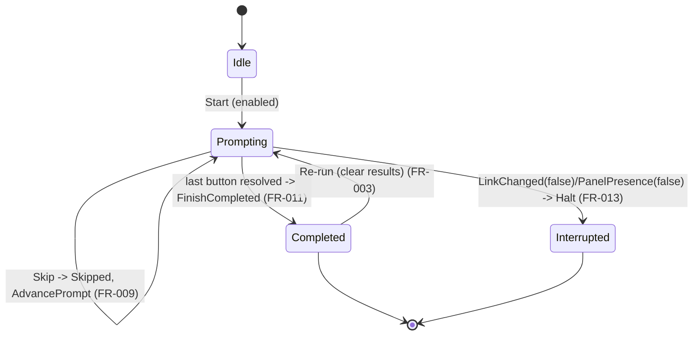

# Data Model: Button-Press Test (Input Side)

**Spec**: [spec.md](./spec.md) | **Plan**: [plan.md](./plan.md) | **Date**: 2026-06-22

Types live in `src/ButtonPanelTester.Core/Can/` (pure) unless noted. Closed DUs carry the mandatory
triple (Lean theorem + FsCheck property + XML-doc citation, `stem-fp-discipline` §3); F# type names
mirror the Lean inductives in `lean/Stem/ButtonPanelTester/Phase4/`. Shapes are indicative, not
final signatures.

## 1. Button-state frame (wire decode — R1)

A decoded `VAR_WRITE` button report. Single-case wrappers prevent primitive confusion; the frame is
a record. Parser mirrors `WhoIAmFrame.fs` (length-only rejection → `option`).

```fsharp
type VariableAddress = VariableAddress of uint16          // 0x80NN
type KeyStateBitmap  = KeyStateBitmap  of byte            // raw wire byte (TxTasti); 0 = pressed bit

type ButtonStateFrame =
    { Address: VariableAddress      // 0x8000 / 0x803E ; 0x80FE = virgin sentinel (not a result)
      Bitmap:  KeyStateBitmap }

module ButtonStateFrame =
    let parse  : ReadOnlyMemory<byte> -> ButtonStateFrame option   // command 0x00:0x02 + addr 0x80NN
    let encode : ButtonStateFrame -> byte[]
```

- Lean: `Phase4/ButtonStateFrame.lean` — `parse_encode_roundtrip`, `encode_length`.
- Validation: command `0x00:0x02` and an address in the button-state set are enforced by the
  observer (R6); `parse` itself rejects only on length, matching the WHO_I_AM precedent.

### 1a. Button-state observation (the emitted envelope — fix #270)

A baptized panel is silent on WHO_I_AM and heartbeats its button-state on a **directed CAN ID** whose
machineType byte (bits 23–16) is the variant. The observer derives the variant from that id and emits
it alongside the frame; the consumer keys observability + the prompt schema off this envelope rather
than discovery (`button-state-wire-format.md` §Directed CAN ID).

```fsharp
// Core/Can/ButtonStateObservation.fs
type ButtonStateObservation =
    { Frame:   ButtonStateFrame
      Variant: MarketingVariant }                 // decoded from (CanId >>> 16) &&& 0xFF

module ButtonStateObservation =
    let variantOfDirectedId : uint32 -> VariantIdentity   // VariantDecoder.decode on bits 23-16
```

- Lean: `Phase4/ButtonStateObservation.lean` — `machine_type_at_bits_23_16` (machineType =
  `(id >>> 16) &&& 0xFF`), `non_marketing_ids_rejected` (broadcast `0x1FFFFFFF` → Virgin, SRID
  `0x00000008` → Unknown are non-marketing → rejected). FsCheck:
  `Property/Can/ButtonStateObservationProperties.fs`.
- Accept rule: a frame is observed **iff** `variantOfDirectedId CanId` is `Marketing _`. Reassembly is
  per source CAN ID.

## 2. Key-state press-edge detector (R2 — the polarity-bearing type)

Pure. Converts two consecutive masked bitmaps into the set of buttons whose bit transitioned
**into pressed** (`1 → 0`, since pressed = `0` on the wire). The pressed-bit value is a single
named constant so a bench surprise is a one-line flip.

```fsharp
[<Literal>]
let PressedBit = 0uy        // firmware: press clears the bit (UserMain.c:1369,:978)

/// Buttons (active-masked bit positions) that went 1 -> 0 between prior and next.
val pressEdges : activeMask: byte -> prior: KeyStateBitmap -> next: KeyStateBitmap -> Set<int>
```

- Baseline: the first observed frame sets `prior`; no absolute byte is ever read as press-state.
- Lean: `Phase4/KeyStateBitmap.lean` — `press_edge_iff_high_to_low`, `inactive_bits_ignored`.

## 3. Active-button schema, per variant (R3/R4 — FR-016)

```fsharp
type FirmwareButton =                     // canonical order = declaration order
    | UP | DOWN | P1 | P2 | P3 | MEM | STOP | LIGHT

type ActiveButton =
    { Button: FirmwareButton              // firmware/diagnostic name
      Bit: int                            // 0..7 (R3)
      Decal: string }                     // primary prompt label (FR-004)

type ButtonSchema =
    { Variant: MarketingVariant           // reuse Core BoardVariant identity
      ActiveMask: byte
      Active: ActiveButton list           // canonical firmware order, filtered to ActiveMask
      Provisional: bool }                 // true for all but OPTIMUS-XP (FR-016)
```

`FirmwareButton` is a closed DU (8 cases) → triple in `Phase4/ButtonSchema.lean`
(`canonical_order_total`). The OPTIMUS-XP row is authoritative; the other three are seeded from
legacy enums and `Provisional = true`. `Active` is the canonical firmware order filtered by
`ActiveMask` — the invariant `test_visits_active_only` rests on this.

| Variant | ActiveMask | Active (order → decal) | Provisional |
|---|---|---|---|
| OPTIMUS-XP | `0x36` | DOWN→Light, P1→Suspension, P3→Up, MEM→Down | false |
| EDEN-XP | `0xFF` | all 8 (legacy EdenButtons labels) | true |
| R-3L XP | `0xFF` | all 8 (legacy R3LXPButtons labels) | true |
| EDEN-BS8 | `0xFF` | all 8 (legacy EdenButtons labels) | true |

(`0x36` = bits 1,2,4,5 = DOWN,P1,P3,MEM.)

## 4. The button-press-test FSM (R7)

Mirrors `Phase3/BaptismSequence` shape: pure state + events + a `step` producing `(state, action)`.

```fsharp
type ButtonOutcome =                      // closed DU → triple (Phase4/ButtonPressTest.lean)
    | Pending | Pass | Missed | Skipped

type InterruptReason =
    | LinkLost | PanelLost

type ButtonPressTestState =
    | Idle
    | Prompting of index: int * deadline: DateTimeOffset * results: ButtonOutcome[]
    | Completed of results: ButtonOutcome[]
    | Interrupted of reason: InterruptReason * partial: ButtonOutcome[]

type TestEvent =
    | PressEdge of bit: int
    | Tick of now: DateTimeOffset
    | Retry
    | Skip
    | LinkChanged of connected: bool
    | PanelPresence of present: bool

type TestAction =
    | NoAction
    | RecordUnexpected of bit: int        // logged, not counted (FR-008)
    | AdvancePrompt of nextIndex: int
    | FinishCompleted
    | Halt of InterruptReason

val step : schema: ButtonSchema -> ButtonPressTestState -> TestEvent
        -> ButtonPressTestState * TestAction
```

State-transition summary (driven by the FRs):



Theorems (R9): `test_visits_active_only`, `result_vector_length`, `test_outcome_total`,
`pass_requires_press_edge`, `skip_never_pass`, `interrupt_excludes_all_passed`, `terminal_absorbs`.

`allActivePassed (results) = results |> Array.forall ((=) Pass)` (FR-011) — false whenever any
`Missed`/`Skipped`/`Pending` remains, and unreachable from `Interrupted`.

## 5. Button result (presentation projection — FR-011/012)

```fsharp
type ButtonResultRow =
    { Decal: string
      Firmware: FirmwareButton
      Outcome: ButtonOutcome
      PressedAt: DateTimeOffset option        // forensic (FR-012)
      UnexpectedSeen: int }                    // count of wrong-button presses during its window
```

A pure projection of FSM state for the result grid; no new domain truth.

## 6. Enablement (FR-001)

```fsharp
type Enablement = Enabled | Disabled of explanation: string   // reuse spec-004 shape

val testEnablement :
    link: CanLinkState -> selectedBaptized: bool -> observable: bool -> Enablement
```

Priority-ordered (link → selected-baptized → observable), mirroring `baptizeEnablement`. Lean
`Phase4/Enablement.lean` — `test_enabled_iff`; FsCheck `TestEnablementGuards`.

> **`observable` / `selectedBaptized` interpretation (fix #270).** The predicate is unchanged (it is
> parametric over the two booleans, and `test_enabled_iff` still holds), but their *source* shifts
> from discovery to the button-state heartbeat: `observable` = a button-state frame was seen within
> `observableWindow`; `selectedBaptized` = that heartbeat carried a known `Marketing` variant (the
> observer only emits Marketing ones), auto-targeting the single heartbeating panel — no UUID
> selection.

### 6a. Recency thresholds (fix #270 — `Core/Can/ButtonPressTest.fs`)

Code-config `TimeSpan` constants (not UI), provisional bench defaults from the ~182 ms idle refresh
cadence — to be confirmed on the rig alongside the press-edge polarity:

| Constant | Default | Role |
|---|---|---|
| `observableWindow` | 2 s | a button-state frame within this window ⇒ the panel is observable (the `observable` enablement conjunct) |
| `panelLostThreshold` | 3 s | no button-state frame for longer than this **during a run** ⇒ `Interrupted PanelLost` (the recency replacement for the discovery-prune presence signal) |

## 7. Observation port (R5 — Infrastructure boundary)

```fsharp
type IButtonStateObserver =                  // Core/Can/Ports.fs (mirror IWhoIAmObserver)
    abstract member ButtonStateObserved : IObservable<ButtonStateObservation>   // frame + variant (§1a)
```

Production adapter `ButtonStateReassemblyObserver` (`Infrastructure/Can`); virtual fake
`InMemoryButtonStateObserver` (`Tests/Fakes/Can`). Accepts a frame iff its directed CAN ID decodes to
a `Marketing` variant (§1a); reassembles per source CAN ID.

## Entity → spec mapping

| Spec entity | This model |
|---|---|
| Button-press test session | §4 `ButtonPressTestState` + the service driving it |
| Active-button schema (per variant) | §3 `ButtonSchema` |
| Button result | §5 `ButtonResultRow` (+ §4 `ButtonOutcome`) |
| Observed button report | §1 `ButtonStateFrame` (+ §2 detector) |
