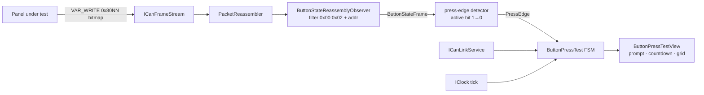

# Implementation Plan: Button-Press Test (Input Side)

**Branch**: `005-button-press-test` | **Date**: 2026-06-22 | **Spec**: [spec.md](./spec.md)

**Input**: Feature specification from [`specs/005-button-press-test/spec.md`](./spec.md) |
**Draft PR**: [#252](https://github.com/luca-veronelli-stem/button-panel-tester/pull/252) (v0.5.0)

## Summary

The tool's first **input-side** test: for a panel already baptized as a known variant, walk the
technician through pressing each *active* button in canonical firmware order — filtered to the
variant's active mask — score each Pass/Missed/Skipped, log Unexpected presses, and end in a
per-button grid plus an "all active passed" verdict, re-runnable in place (FR-001…016). The test is
**pure observation, RX-only** — it transmits nothing (the baptism TX path is not exercised).

The technical core is small and rides ≈80 % on the spec-002/003/004 receive path: a **button-frame
parser** (`VAR_WRITE` → key-state bitmap, firmware-verified in [research.md](./research.md) R1) and
a **press-edge detector** whose polarity is pinned to firmware ground truth (R2: pressed = bit `0`;
the field-proven legacy app's set-bit-pressed actually read the *release* edge — explained, not
guessed); a **per-variant button schema** (R3/R4, OPTIMUS-XP authoritative, the other three
provisional); a new **RX observation port** mirroring spec-003 (R5); and the **button-press-test
FSM** (R7) with **Lean Phase 4** ahead of every F# slice. The GUI is a functional pure-render
section (the visual-hierarchy design is a deferred late-train spec).

## Technical Context

**Language/Version**: F# on .NET 10 (`net10.0`; `net10.0-windows` only for the PEAK-bound projects,
per STEM PORTABILITY).

**Primary Dependencies**: locked stack — Avalonia 11.3.x + FuncUI 1.5.x (Elmish-MVU),
`Peak.PCANBasic.NET`, the vendored STEM protocol stack (RX chain `ICanFrameStream` →
`PacketReassembler`, reused as-is). Lean 4 (pinned toolchain, no mathlib).

**Storage**: none — forensic trail goes to the structured log (FR-012); no result persistence (FR-015).

**Testing**: xUnit 2.9.x + FsCheck.Xunit 3.3.x + Avalonia.Headless.XUnit; manual fakes only
(`InMemoryButtonStateObserver`, `InMemoryCanLink`, `FrozenClock`). PEAK-bound E2E is
`Category=Hardware`.

**Target Platform**: Windows desktop (Avalonia) for the PEAK driver; logic projects platform-neutral.

**Project Type**: desktop application, archetype A, cohabiting the existing CAN code.

**Performance Goals**: SC-002 press → Pass ≤ ~1 s; SC-003 Missed within ~1 s of the 10 s window;
SC-005 interruption surfaced within a small handful of seconds.

**Constraints**: RX-only (no TX); detection = press-edge on the active-masked key-state bitmap, not
discrete events; baseline seeded from the first frame (R2); default 10 s per-button timeout
(code-config, not UI); discovery/link semantics untouched (consumed, not modified).

**Scale/Scope**: single bench panel; 4-variant hardcoded `ButtonSchema` (1 authoritative, 3
provisional); ≤ 8 prompts per run.

## Constitution Check

*GATE: must pass before Phase 0. Re-checked after Phase 1 design — still PASS.*

- **I. Formal Verification of Invariants** *(NON-NEGOTIABLE)* — new Lean **Phase 4** under
  `lean/Stem/ButtonPanelTester/Phase4/` (umbrella `Phase4.lean`):
  - `ButtonStateFrame.lean` — codec; `parse_encode_roundtrip`, `encode_length`.
  - `KeyStateBitmap.lean` — press-edge detector; `press_edge_iff_high_to_low`, `inactive_bits_ignored`.
  - `ButtonSchema.lean` — `canonical_order_total` (active list = firmware order filtered by mask).
  - `ButtonPressTest.lean` — the FSM: `test_visits_active_only`, `result_vector_length` (both
    roadmap §spec-004), `test_outcome_total`, `pass_requires_press_edge` (FR-006), `skip_never_pass`
    (FR-009), `interrupt_excludes_all_passed` (FR-013), `terminal_absorbs` (never-flip).
  - `Enablement.lean` — `test_enabled_iff` (FR-001).

  Order per Principle I: Lean spec → FsCheck/xUnit → F#. No `sorry`, no custom axioms.

- **II. Property-Driven Correctness** — FsCheck in `tests/ButtonPanelTester.Tests/Property/Can/`:
  `ButtonStateFrameRoundtrip`, `PressEdgeDetectsHighToLow` + `InactiveBitsIgnored`,
  `SchemaActiveOnlyInOrder`, `TestOutcomeTotal`, `PassRequiresPressEdge`, `SkipNeverPass`,
  `InterruptExcludesAllPassed`, `TestEnablementGuards` (each mirrors a Phase-4 theorem).
  Example-based (one-line rationale each): the wire **fixture** (`buttonStateFixtures.json`,
  sanctioned concrete protocol fixture) and **integration** tests for timing, Unexpected-not-counted,
  Retry/Skip, link/panel loss, and forensic-log emission (they assert wiring/timing across threads,
  not pure laws).

- **III. Ports and Adapters for Every External Boundary** — **no new external boundary.** CAN RX is
  already consumed through `ICanFrameStream` (+ shared `PacketReassembler`); `IClock`,
  `ICanLinkService`, `IPanelDiscoveryService` are consumed unchanged. One **new observation port**
  `IButtonStateObserver` (`Core/Can`) over that boundary — production adapter
  `ButtonStateReassemblyObserver` (`Infrastructure/Can`), virtual adapter
  `InMemoryButtonStateObserver` (`Tests/Fakes`) — contract:
  [contracts/button-state-observer-port.md](./contracts/button-state-observer-port.md). Mirrors
  spec-003's `IWhoIAmObserver` exactly.

- **IV. CI Greens the Whole Stack; Hardware Tests Are Explicit** — (a) property + integration +
  Avalonia.Headless layers all extended (Phase A–F); (b) the new bench E2E
  (`ButtonPressTestHardwareTests.fs`, `[<Trait("Category","Hardware")>]` + env-gated, never bare
  `Skip`) is **named here and linked to a dedicated bench-validation tracking issue filed alongside
  `/speckit-tasks`** (mirrors #237's role for baptism SC-004; the prior bench tracker #112 is
  closed); (c) no `[<Fact(Skip = …)>]`.

- **V. Supplier-Deployed Identity Is Hashed at Capture** *(NON-NEGOTIABLE)* — **no identity-bearing
  data on this feature's path.** The test observes button bits; panel UUIDs are device hardware
  identifiers (not OS user / machine / SID / MAC); the forensic log carries no operator identity;
  nothing crosses to STEM-controlled storage (no persistence — FR-015).

- **VI. Stopgap Discipline** — **no new stopgap.** The vendored protocol stack is inherited under
  #111. The VAR_WRITE command (`0x00:0x02`) and button-state address set are hardcoded **inline at
  the new observer**, exactly as spec-003 hardcodes WHO_I_AM `0x0024` — extending the existing
  inherited hardcoded-metadata set, not a new bypass (R6). Its fetch migration (CORRECTIONS §C5)
  stays deferred to its own standalone ticket (decoupled from the parked #156, per memory
  `spec-002-c5-stopgap-deferred`) — a parked roadmap migration, not a principle violation. The
  polarity decision is firmware-pinned (not a stopgap); the provisional non-OPTIMUS variants are an
  honesty posture (flagged provisional, FR-016), not a violation.

**Result: PASS.** Complexity Tracking is empty.

## Project Structure

### Documentation (this feature)

```text
specs/005-button-press-test/
├── spec.md                                  # approved (do not regenerate)
├── plan.md                                  # this file
├── research.md                              # Phase 0 — R1..R10 (firmware-verified wire + polarity)
├── data-model.md                            # Phase 1 — parser, detector, schema, FSM, enablement
├── contracts/
│   ├── button-state-wire-format.md          # Phase 1 — VAR_WRITE button-frame format + polarity
│   └── button-state-observer-port.md        # Phase 1 — IButtonStateObserver port
├── quickstart.md                            # Phase 1 — developer + bench walkthrough
├── checklists/requirements.md               # spec quality checklist (approved)
└── tasks.md                                 # /speckit-tasks output (not this command)
```

### Source code (repository root) — archetype A, cohabiting the CAN code

```text
src/
├── ButtonPanelTester.Core/Can/                     net10.0
│   ├── ButtonStateFrame.fs      NEW      VAR_WRITE button-frame codec (R1)
│   ├── KeyStateBitmap.fs        NEW      press-edge detector + PressedBit constant (R2)
│   ├── ButtonSchema.fs          NEW      4-variant active mask + decal labels (R3/R4)
│   ├── ButtonPressTest.fs       NEW      FSM types + step + outcomes + enablement (R7)
│   └── Ports.fs                 EXTEND   + IButtonStateObserver (R5)
├── ButtonPanelTester.Services/Can/                 net10.0
│   ├── ButtonPressTestService.fs  NEW    FSM driver: prompt → observe → score; Retry/Skip/Re-run
│   └── ButtonPressTestLogging.fs  NEW    structured forensic records (FR-012, R10)
├── ButtonPanelTester.Infrastructure/Can/           net10.0-windows
│   └── ButtonStateReassemblyObserver.fs  NEW   RX adapter over ICanFrameStream + PacketReassembler
└── ButtonPanelTester.GUI/                          net10.0-windows
    ├── Can/ButtonPressTestView.fs  NEW   prompt + countdown + result grid + Retry/Skip (functional)
    ├── Composition/CompositionRoot.fs  EXTEND  wire observer + ButtonPressTestService
    └── App.fs                    EXTEND   button-test surface slot + Msg/update

tests/
├── ButtonPanelTester.Tests/                        net10.0
│   ├── Property/Can/*            NEW      codec/detector/schema/FSM/enablement properties
│   ├── Fixtures/Can/buttonStateFixtures.json  NEW  concrete VAR_WRITE wire fixture
│   ├── Fakes/Can/InMemoryButtonStateObserver.fs  NEW
│   └── Integration/Can/          NEW      timing, Unexpected, Retry/Skip, link/panel loss, log
└── ButtonPanelTester.Tests.Windows/                net10.0-windows
    ├── Gui/Can/ButtonPressTestViewTests.fs   NEW  Avalonia.Headless (enable matrix, grid render)
    └── Integration/Can/Hardware/ButtonPressTestHardwareTests.fs  NEW  Category=Hardware

lean/Stem/ButtonPanelTester/
├── Phase4.lean                  NEW      umbrella
└── Phase4/                      NEW      ButtonStateFrame, KeyStateBitmap, ButtonSchema,
                                          ButtonPressTest, Enablement
```

**Structure Decision**: archetype A, unchanged. The button-press test cohabits the CAN projects
beside discovery/baptism; the RX path is consumed through the new observation port, never by
referencing the vendored stack from Services.

## Consumed surfaces (spec-002 / 003 / 004) — consumed vs not modified

| Surface | Owner | This feature | Notes |
|---|---|---|---|
| `ICanFrameStream`, `PacketReassembler`, `SubjectFanOut` | spec-002/003 + #111 | **consumed** | RX input + reassembly (reused, not modified) |
| `ICanLinkService` / `CanLinkState` | spec-002 | **consumed** | Connected gate (FR-001); link-lost interruption (FR-013) |
| `IPanelDiscoveryService` / `PanelsOnBus` | spec-003 | **consumed** | selected-panel observability; panel-lost interruption |
| `IClock` | spec-002 | **consumed** | per-button 10 s deadline |
| `MarketingVariant` / `BoardVariant` identity | spec-003/004 | **consumed** | schema keys off the variant the panel was baptized as |
| `App.fs` / `CompositionRoot.fs` | spec-002+ | **extended (additive)** | test surface slot + service wiring |

## At a glance



## Implementation phases

Ordered, each a bisect-safe vertical slice (`bisect-safe` + `vertical-commits`); `/speckit-tasks`
expands these into `tasks.md`. Lean lands ahead of F# inside every slice that has theorems.

- **Phase A — Wire foundation.** `Phase4/ButtonStateFrame.lean` + `Phase4/KeyStateBitmap.lean`;
  F# `ButtonStateFrame` codec + `KeyStateBitmap` press-edge detector (+ `PressedBit`); FsCheck
  round-trip + edge properties + `buttonStateFixtures.json`.
- **Phase B — Variant schema.** `Phase4/ButtonSchema.lean`; `ButtonSchema` table (OPTIMUS-XP
  authoritative, three provisional); `SchemaActiveOnlyInOrder` property.
- **Phase C — Observation port + adapters.** `IButtonStateObserver`; `InMemoryButtonStateObserver`
  fake; `ButtonStateReassemblyObserver` over `ICanFrameStream` + reused `PacketReassembler`
  (frame synthesis asserted against a fake stream, spec-003 precedent); composition wiring.
- **Phase D — Test FSM.** `Phase4/ButtonPressTest.lean` (FSM + the seven theorems); F# `step` +
  `ButtonOutcome`; FsCheck FSM properties.
- **Phase E — Service.** `Phase4/Enablement.lean`; `ButtonPressTestService` (drive FSM, link/panel
  guards, 10 s deadline via `FrozenClock`, Retry/Skip/Re-run, forensic logging) + enablement
  predicate; integration tests (timeout, Unexpected, Retry, Skip, link/panel loss, log emission).
- **Phase F — GUI.** `ButtonPressTestView` (prompt, countdown, result grid, Retry/Skip, enablement
  hint — functional layout); `App.fs` + composition wiring; Avalonia.Headless enable-matrix + grid
  tests.
- **Phase G — Hardware E2E + bench validation.** *(The done line — CI-green is code-complete.)*
  `ButtonPressTestHardwareTests.fs` (`Category=Hardware`, env-gated): full OPTIMUS-XP bench run
  (SC-001/002/003/004/005) **and the R2 polarity confirmation** (scoring fires on press, not
  release); quickstart bench section; linked to the dedicated bench tracking issue.

## Complexity Tracking

> Empty — no new stopgaps, no unresolved Constitution gate. The vendored protocol stack is the only
> stopgap in scope and is inherited (#111), not introduced.

## Tooling note

`.specify/feature.json` pins `specs/005-button-press-test`, so the speckit scripts resolve the
feature dir from the issue-conventional branch name without overrides. No agent-context update script
exists in `.specify/scripts/bash/` (only `check-prerequisites`, `common`, `create-new-feature`,
`setup-plan`, `setup-tasks`) — the agent-file update step of `/speckit-plan` is N/A in this repo. The
`before_plan` extension hook is the optional `speckit.git.commit` (`/speckit.git.commit`); working
tree was clean at plan start, so it was a no-op.

## Status

*Created 2026-06-22 by `/speckit-plan` (fresh context per the RPI overlay).*

### Completed (this run)

- Phase 0 — [research.md](./research.md) R1–R10: the two load-bearing pins settled against firmware
  ground truth (`pac5524-tastiera-can-app` `UserMain.c`) — command `0x00:0x02` + address `0x80NN`
  (R1/R6), polarity pressed = bit `0` with the legacy release-edge conflict explained (R2) — plus
  the triply-confirmed OPTIMUS-XP schema and the reuse map.
- Phase 1 — [data-model.md](./data-model.md), the two contracts, [quickstart.md](./quickstart.md).
  Constitution Check PASS (Complexity Tracking empty).

### Next

- `/speckit-checklist` (constitution-recommended: protocol framing + state machine), then
  `/speckit-tasks` → `tasks.md` (expands Phases A–G), `/speckit-analyze` before `/speckit-implement`.
  Scope is epic-sized (parser/detector, schema, observer, Lean Phase 4 FSM, service, GUI, hardware
  gate) — it **does not fit one bisect-safe PR**; implementation decomposes into ordered
  resolve-ticket child PRs (one per phase), filed after `/speckit-tasks` along with the
  bench-validation tracking issue.

### Amendment 2026-06-24 (fix #270) — observability re-keyed to the button-state heartbeat

Bench validation (#253) invalidated the **R5 observation assumption** that the button-state RX seam can
be keyed the way WHO_I_AM discovery is. A baptized panel is silent on WHO_I_AM (`CORRECTIONS.md` §C1)
and heartbeats its button-state on a **directed CAN ID** (machineType at bits 23–16), so: (1) the
Phase C `ButtonStateReassemblyObserver` must accept directed SP_APP IDs (match-any-non-broadcast +
variant-from-ID) instead of broadcast `0x1FFFFFFF` only — **Phase C is back in scope**; (2) the
observation envelope carries the variant; (3) the Phase E service + Phase F GUI key observability /
panel-loss / variant off **button-state recency** (configurable thresholds, bench-confirmed) and the
service **drops `IPanelDiscoveryService`** from the button-press path (auto-target the single
heartbeating panel, one-at-a-time); (4) Phase G drops the WHO_I_AM precondition. The architecture
otherwise stands (FSM, schema, detector, enablement DU unchanged; `test_enabled_iff` is parametric over
the `observable` boolean — its *interpretation* shifts, the theorem holds). Authority: spec.md
§Clarifications (Session 2026-06-24) + tasks.md §Phase I (T044–T049). Constitution Check still PASS
(no new bypass; the inline command/address hardcode R6 stays, now matching directed IDs).

### Amendment 2026-07-20 (fix #293) — dual-rate heartbeat: thresholds recalibrated, unarmed scoring

A firmware + trace re-read (no bench run) showed the Phase I recency thresholds were calibrated
against the heartbeat's **post-boot fast ramp**, not its idle steady state. The refresh is
**dual-rate** (`UserMain.c:1013–1020`): ≈ 188 ms while the latched bitmap is non-zero, ≈ **12.5 s**
(`TEMPO_CAN_LENTO`) while it is zero — and since `TxTasti` is zero-init with bits latching on
release, a cold never-touched panel sits in the slow branch. Consequences for this plan:

1. **Thresholds** — `observableWindow` / `panelLostThreshold` go 2 s / 3 s → **15 s / 20 s** (above
   `TEMPO_CAN_LENTO`), now **firmware-derived, not bench-provisional**; the 2026-06-24 amendment's
   "(configurable thresholds, bench-confirmed)" phrasing is superseded. §Performance Goals'
   "interruption surfaced within a small handful of seconds" now holds for **link-loss only**;
   panel-power-loss detection takes up to ≈ 20 s by design (SC-005 amended accordingly).
2. **Unarmed scoring** — a cold panel **never transmits a position's first press** (clearing an
   already-clear bit fires no change gate, `UserMain.c:1369`/`:973`), so §Constraints'
   "detection = press-edge" gains an exception: an **unarmed** position (never yet observed
   released) scores on its `0 → 1` release transition; armed positions keep the press edge.
   `pressEdges` is unchanged; a `scored`/armed predicate layers above it (`data-model.md` §6b).
   FR-006/SC-002 amended; polarity (`PressedBit = 0uy`) confirmed correct, untouched.
3. **Hardware suite** — `ButtonPressTestHardwareTests.fs` waited `heartbeatTimeout = 2 s` for the
   first observation, encoding the same misread cadence; raised above `TEMPO_CAN_LENTO` alongside
   the #253 checklist hooks.
4. **Constitution Check** — still PASS. The arming rule ships with the mandatory triple (Lean
   theorem in `Phase4/KeyStateBitmap.lean` + FsCheck property + XML doc citation), Lean-first as a
   separate Lean-only commit per Principle I (tasks.md §Phase J). `test_enabled_iff` stays
   parametric over `observable`; no new stopgap, no new boundary.

Authority: spec.md §Clarifications (Session 2026-07-20), research.md R1 (dual-rate derivation),
data-model.md §6a/§6b, tasks.md §Phase J (T050–T054). Tracked as corrective child **#293** (PR #294).

### Amendment 2026-07-23 (fix #296) — heartbeat is destination-addressed: variant from the senderId

The first live observation of a **tool-baptized** panel (`bench-logs/pcan/test1.trc`, taken as the
#253 step-D sanity capture) showed every heartbeat frame on arbitration ID `0x00000008` — the
tool's own SRID, which the #270 observer explicitly drops. Firmware: the arbitration ID is the
**destination** (`UserMain.c:997` `app.srid = MotherBoardAddress`, written from the baptizing
master's srid, `AutoAddressSlave.c:238-241`); the June ground-truth panels were machine-baptized,
and a machine master coincidentally shares the machineType byte with its keyboard — the #270
variant-from-arbitration-ID rule worked on those captures by coincidence. Consequences:

1. **Observer accept rule** — moves to completed-packet level: cmd `0x0002` + recognised
   button-state address + **senderId machineType (bits 23–16) decodes Marketing**. No
   arbitration-ID pre-filter; reassembly stays per source arbitration ID (chunks carry no
   senderId). WHO_I_AM drops on cmd; the `0x80FE` virgin sentinel drops on address; the tool never
   receives its own TX.
2. **Variant source** — `ButtonStateObservation.Variant` decodes from the senderId word. The T044
   bits-23-16 extraction lemma is word-agnostic and carries over; new senderId-level theorems land
   Lean-first (T055) before the F# re-key (T056), per Principle I.
3. **Unchanged** — recency thresholds + arming (#293), auto-target, FSM, GUI, forensic log. FR-001
   meaning intact; only frame acceptance moves. The 2026-06-24 amendment's "accept iff the CAN ID
   decodes Marketing" clause is superseded.
4. **Constitution Check** — still PASS: mandatory triple on the senderId wire fact, Lean-first
   split, no new boundary, no new stopgap (the inline cmd/addr hardcode stays as inherited).

Authority: spec.md §Clarifications (Session 2026-07-23), research.md R1 destination-addressing
addendum, wire-format + observer-port contracts (#296 sections), tasks.md §Phase K (T055–T057).
Tracked as corrective child **#296** (PR #297).
